# Node.js

## 什么是node.js

**Node.js是基于chrome v8的JavaScript运行环境。**

* 浏览器是JavaScript的前端运行环境。
* Node.js是JavaScript的后端运行环境。
* Node.js中无法调用DOM和BOM等浏览器内置的API。

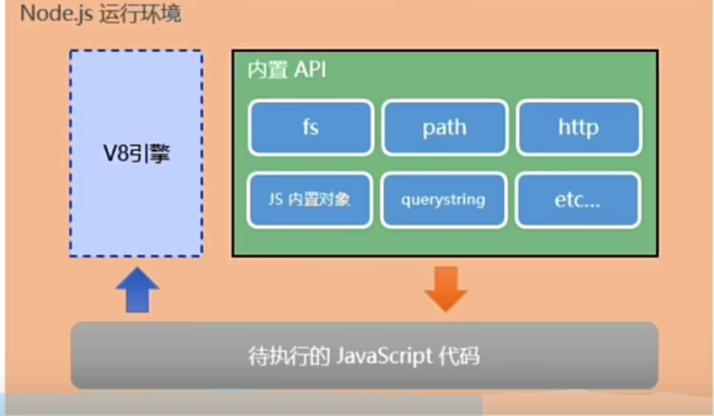

## Node.js可以做什么

Node.js作为JavaScript的运行环境，仅提供了基础的功能和API。基于这些基础，出现了许多强大的工具。

* 基于Express框架，可以快速构建Web应用。
* 基于Electron框架，可以构建跨平台的桌面应用。
* 基于restify框架，可以快速构建API接口项目。
* 读写和操作数据库，创建实用的命令行工具辅助前端开发。

## Node.js学习路径

* JavaScript基础语法
* Node.js内置API模块（fs，path，http等）
* 第三方模块，Express，mysql等

## fs文件系统模块

### 什么是fs文件系统模块

fs模块是node.js官方提供的，用来操作文件的模块。

```javascript
const fs = require('fs')
```

### fs读取文件

```javascript
const fs = require('fs')

fs.readFile('./files/1.txt', 'utf-8', (err, dataStr) => {
    console.log(err)
    console.log('------')
    console.log(dataStr)
})
```

* 第一个参数是文件的路径地址
* 第二个参数表示读取文件的编码格式，是可选参数
* 第三个参数是读取文件后的回掉，err表示读取失败，dataStr表示读取成功

### fs写入文件

```javascript
fs.writeFile('./files/2.txt', 'test', null, (err) => {
    console.log(err)
})
```

* 第一个参数表示文件路径
* 第二个参数表示写入的数据
* 第三个参数表示以什么编码方式写入数据到文件路径，是可选参数，默认为utf8
* 第四个参数回掉函数

### fs动态拼接路径问题

在使用fs时，如果提供的操作路径时./或../开头的相对路径时，很容易出现路径拼接错误的问题。

原因：代码在运行的时候，会以执行node命令时所处的目录，动态拼接操作文件的完整目录。

解决方案：在使用fs模块操作文件时，直接提供完整的文件路径，而不要使用相对路径。

```javascript
fs.readFile(__dirname + '/files/1.txt', 'utf-8', (err, dataStr) => {
    console.log(err)
    console.log('------')
    console.log(dataStr)
})
```

* `__dirname`表示当前文件所处目录

### fs写入文件注意点

* `fs.write()`只能用于创建文件，不能创建目录
* 如果多次调用`fs.write()`方法写入同一个文件，新的内容会覆盖之前的内容

## path路径模块

### 什么是path路径模块

path模块时node.js提供的，用来处理路径的模块。它提供了一系列的方法和属性，用来满足用户对路径的处理需求。

### 路径拼接

`path.join()`

可以把多个路径片段拼接为完整的路径字符串。

```javascript
const path = require('path')

fs.readFile(path.join(__dirname, '/files/1.txt'), 'utf-8', (err, dataStr) => {
    console.log(err)
    console.log('------')
    console.log(dataStr)
})
```

### 获取路径中的文件名

`path.basename(path[, ext])`

可以获取路径的最后一部分，经常用这个方法获取路径中的文件名

* 第一个参数表示路径
* 第二个参数表示文件的扩展名，可选的
* 返回路径的最后一部分

```javascript
const filePath = 'a/b/c/index.html'
const basePath = path.basename(filePath)
const basePathWithoutExt = path.basename(filePath, '.html')
console.log(basePath, basePathWithoutExt)
```

### 获取文件的扩展名

`path.extname(path)`

* path表示文件的路径
* 返回文件的扩展名

```javascript
const ext = path.extname(filePath)
console.log(ext)
```

## http模块

### 什么是http模块

客户端：负责消费资源的电脑

服务端：负责对外提供网络资源的电脑

http是node.js官方提供的，用于创建web服务器的模块。通过http的`http.createServer()`方法，就能方便的把一台普通的电脑，变成一台web服务器，从而对外提供web资源服务。

服务器和普通电脑的区别在于，服务器上安装了web服务器软件，例如IIS，Apache等。通过安装这些服务器软件，就能把一台普通的服务器变为web服务器。

在node.js中，我们不需要使用IIS，Apache等这些第三方的web服务器软件，因为我们可以基于node.js提供的http模块，通过几行简单的代码，就能轻松的创建一个web服务器软件，从而对外提供web服务。

### 服务器的相关概念

* IP
* 域名
* 端口号

### 创建基本的web服务器

* 导入`http`模块
* 创建web服务器
* 为服务器实例绑定request事件，监听客户端请求
* 启动服务器

```javascript
const http = require('http')
const server = http.createServer()
server.on('request', (req, res) => {
    console.log('someone has requested the server')
})
server.listen(80, () => {
    console.log('server is running at http://127.0.0.1:80')
})
```

### req请求对象

req存放的客户端相关数据和属性。

* `req.url`是客户端请求的URL地址
* `req.method`是客户端请求的类型

### res响应对象

用于响应客户端的请求操作

```javascript
const http = require('http')
const server = http.createServer()
server.on('request', (req, res) => {
    const url = req.url
    const method = req.method
    console.log('url=', url, 'method=', method)
    const str = `request url is ${url}, request method is ${method}`
    console.log('someone has requested the server')
    res.end(str)
})
server.listen(80, () => {
    console.log('server is running at http://127.0.0.1:80')
})
```

### 解决中文乱码问题

```javascript
const http = require('http')
const server = http.createServer()
server.on('request', (req, res) => {
    const url = req.url
    const method = req.method
    res.setHeader('Content-Type', 'text/html;charset=utf8')
    const str = `请求的地址是 ${url}, 请求的类型为 ${method}`
    console.log('someone has requested the server')
    res.end(str)
})
server.listen(80, () => {
    console.log('server is running at http://127.0.0.1:80')
})
```

### 根据不同的url响应不同的内容

```javascript
const http = require('http')
const server = http.createServer()
server.on('request', (req, res) => {
    const url = req.url
    
    let content = '404 not found!'
    switch(url) {
        case '/':
        case '/index.html':
            content = '<h1>首页</h1>'
            break
        case '/about.html':
            content = content = '<h1>关于页面</h1>'
            break
        default:
            break
    }
    res.setHeader('Content-Type', 'text/html;charset=utf8')
    res.end(content)
})
server.listen(80, () => {
    console.log('server is running at http://127.0.0.1:80')
})
```

## 模块化的基本概念

### 什么是模块化

模块化是解决一个复杂问题时，自顶向下逐层把系统划分层若干模块的过程。对整个系统来说，模块是可组合，分解和更换的单元。

编程领域中的模块化，指遵循固定的规则，把一个大文件拆成独立并互相依赖的多个小模块。

优势：

* 提高代码的可复用性
* 提高代码的可维护性
* 可以实现按需加载

模块化规范：对代码进行拆分和组合时，需要遵循的那些规范。

* 使用什么方式来引入模块
* 模块使用什么样的语法格式来暴露成员

## 模块的分类

node.js中的模块根据来源的不同，可以分为三种

* node.js内置的模块，如fs，path，http等
* 自定义模块，用户自己创建的js文件都是自定义模块
* 第三方模块，由第三方开发的模块，使用前需要先下载

## 模块的加载

使用`require()`可以根据需要加载内置模块，用户自定义模块和第三方模块。

注意：使用`require()`方式加载模块时，会执行被加载模块中的代码；并且可以省略`.js`后缀名

## 模块的作用域

### 什么是模块作用域

模块作用域和函数作用域类似，自定义模块中的变量、方法等成员，只能在当前模块中被访问，这种模块级别的访问限制，被称为模块作用域。

好处：防止全局变量污染问题。

### 向外共享模块作用域中的成员

* module对象

每个js模块中都有一个module对象，它里面存储来当前模块的相关信息

```shell
Module {
  id: '.',
  path: '/Users/matt/Desktop/Learning/Web/demo',
  exports: {},
  filename: '/Users/matt/Desktop/Learning/Web/demo/index.js',
  loaded: false,
  children: [],
  paths: [
    '/Users/matt/Desktop/Learning/Web/demo/node_modules',
    '/Users/matt/Desktop/Learning/Web/node_modules',
    '/Users/matt/Desktop/Learning/node_modules',
    '/Users/matt/Desktop/node_modules',
    '/Users/matt/node_modules',
    '/Users/node_modules',
    '/node_modules'
  ]
}
```

* `module.exports`对象

在自定义模块中，可以使用`module.exports`对象，将模块的成员共享出去，供外界使用。

外界使用`require()`方法导入自定义模块时，得到的就是`module.exports`所指向的对象。

```javascript
module.exports.username = 'zs'
module.exports.test = () => {
    console.log('hello')
}
```

* exports对象

由于module.exports写起来比较复杂，为了简化向外共享成员的代码，node提供来exports对象，默认情况下，exports和module.exports指向同一个对象，最终共享的结构，还是以module.exports指向的对象为准。

```javascript
exports.username = 'zs'
exports.test = () => {
    console.log('hello')
}
```

### 模块化规范

Node.js遵循来CommonJS模块化规范，CommonJS规定了模块的特性和各模块间如何相互依赖。

CommonJS规定

* 每个模块内部，module变量代表当前模块
* module变量是一个对象，它的exports（即moduel.exports）属性是对外的接口
* 加载某个模块，其实是加载该模块的moduel.exports属性，require方法用于加载模块

## 包的概念

Node.js中的第三方模块又叫包。是第三方提供的，免费且开源的。

### 安装指定版本的包

默认情况下，`npm i` 会安装最新版本的包，可以使用@符号安装指定版本的包

```shell
npm i moment@2.22.2
```

### 包的语义化规范

包的版本号是以点分十进制形式进行定义的，总共有三位数，例如2.24.0

其中每一位数字所代表的含义如下：

第一位数字：大版本

第二位数字：功能版本

第三位数字：bug修复

版本号提升的规则：只要前面的版本号增加了，后面的版本号则归零。

### 包管理配置文件

`package.json`中配置了包的名称，版本号以及用于开发环境以及生产环境的包的相关信息。在项目协同开发过程中，`node_modules`所占用的体积是很大的，实际的项目源文件不会很大，所以实际开发过程中，通常不会上传node_modules文件，而是上传`package.json`文件，这样其他人员可以通过该文件安装对应的node包到自己本地项目，从而实现协同开发。

### 创建`package.json`文件

```shell
npm init -y
```

使用该命令可以在项目的根目录下创建一个`package.json`文件，注意：项目文件名必须为英文名称，且不包含空格。

### 镜像服务器

解决npm下载慢的问题，可以使用淘宝镜像服务器。

镜像：是一种文件存储形式，一个磁盘上的数据在另一个磁盘上存在完全相同的副本即为镜像。

## 包的分类

### 项目包

* 开发依赖包

被记录到`devDependencies`节点中的包，只在开发环境中使用

* 核心依赖包

被记录到`dependencies`节点中的包，在开发和项目上线后都会用到的

### 全局包

`npm install xx -g`

使用该命令安装的包为全局包。

只有工具性质的包，才有安装为全局包的必要性。

## 规范的包结构

* 包必须以单独的目录存在
* 包的目录下必须包含`package.json`这个包管理配置文件
* `package.json`文件中必须包含`name`,`version`,`main`这三个属性，分别代码包名，包的版本以及包的入口

## 如何发布包

### 创建自己的包

1.新建1个文件见，`matt-tools`

2.在该目录下创建3个文件，`package.json`,`index.js`,`README.md`

* package.json： 包的配置文件
* index.js：包的入口文件
* README.md：包的说明文档

### 将不同的功能进行模块化拆分

* 格式化时间的功能，拆分到src->dateFormat.js中
* 将处理HTML字符串的功能，拆分到src->htmlEscape.js中
* 在index.js中，导入两个模块，得到需要向外共享的方法
* 在index.js中，使用`module.exports`把对应的方法共享出去

```javascript
const dateFormat = require('./src/dateFormat')
const htmlEscape = require('./src/htmlEscape')

module.exports = {
    ...dateFormat,
    ...htmlEscape
}
```

### 编写包的说明文档

包根目录下的`README.md`文件，是包的使用说明文档。

该文档包含以下内容：

包的安装方式，导入方式，格式化时间，转移HTML中的特殊字符，还原HTML中的特殊字符，开源协议。

### 发布包到npm

1.注册npm账号

2.登陆npm（在终端登录`npm login`，输入用户名，邮箱和密码）

注意：在运行该命令之前，必须把下包地址切换为官方的地址。否则会导致发布包失败。

3.将终端切换到包的根目录下，运行`npm publish`，即可将包发布到npm上。（注意，包名不能雷同）

### 删除已经发布的包

运行`npm unpublish xx --force`，即可从npm删除已经发布的包。

注意：

1.只能删除72小时内发布的包。

2.通过该命令发布的包，在24小时内不能重复发布包。

## 模块的加载机制

1.优先从缓存中加载。模块在第一次加载后会被缓存，这也意味着多次调用`require()`方法，不会导致模块的代码被执行多次。

注意：不论是哪只模块，第三方模块还是用户自定义模块，都会优先从缓存中加载，从而提高模块的加载效率。

2.内置模块的加载机制

内置模块是由nodejs官方提供的，优先级是最高的。

例如，`require('fs')`始终返回的是内置模块fs，即使在`node_modules`文件夹下有相同名字的fs模块。

 3.自定义模块的加载机制

使用`require()`记载自定义模块时，必须指定以`./`, `../`开头的路径标识符，在加载自定义模块时，如果没有指定`./`, `../`这样的路径标识符，则node会把它们当作内置模块或者第三房模块加载。

如果我们在加载自定义模块时，没有指定文件的扩展名，则会按照以下方式进行加载

* 按照确切的文件名进行加载
* 补全`.js`扩展名进行加载
* 补全`.json`扩展名进行加载
* 补全`.node`扩展名进行加载
* 加载失败报错

 4.第三方模块的加载机制

如果传递给`require()`的模块标识符不是一个内置模块，也不是以`./`, `../`开头，则Node.js会从当前文件的父目录开始，尝试从`node_modules`文件夹下加载模块，如果没有找到，继续往上一层目录找，知道找到或者到根目录依旧没有找到，则报错。

5.目录作为加载模块

当把目录作为模块标识符，传递给`require()`进行加载的时候，有三种加载方式：

* 在被加载的目录下找一个`package.json`的文件，并寻找main属性，作为`require()`的加载入口
* 如果目录没有`package.json`文件，或者main属性不存在或无法解析，则Node.js会尝试加载目录下的`index.js`文件
* 如果以上两步都失败了，则Node.js会在终端打印错误消息，报告模块缺失

## Express

目录

* 初识Express
* Express路由
* Express中间件
* 使用Express写接口

### Express简介

**概念**

Express是基于node.js平台，快速，开放，极简的web开发框架。

Express的作用和node.js的http内置模块类似，都是用于创建web服务器的。

Express本质：就是一个npm的三方包，提供了快速创建web服务器的便捷方法。

为什么有http模块，还要使用Express模块？

http模块使用起来较为复杂，开发效率低，Express是基于内置的http模块进一步封装的，能够极大的提高开发效率。

http模块和Express模块的关系：类似web API和jQuery的关系，是在其基础上进一步封装出来的。

**Express能做什么**

对于前端程序员来说，最常见的两种服务器，分别是：

Web网站服务器：专门用于提供Web网页资源的服务器；

API接口服务器：专门对外提供API接口的服务器

使用Express，我们可以快速，便捷的创建Web网站服务器和API接口服务器。

### Express的基本使用

**安装**

```shell
npm i express
```

**基本使用**

```js
// 导入
import express from 'express'
// 创建web服务器
const app = express()
// 启动服务器
const app.listen(80, () => {
  console.log('express server is running at http://127.0.0.1')
})
```

**监听GET和POST请求**

```js
// 监听GET和POST请求
app.get('/user', (req, res) => {
    // 调用express提供的res.send方法向客户端发送一个JSON对象
    res.send({name: 'zs', age: 18, gender: 'man'})
})

app.post('/user', (req, res) => {
    res.send('request successfully!')
})

```

**获取URL携带的查询参数**

```js
app.get('/', (req, res) => {
    // 通过req.query获取客户端的查询参数
    console.log(req.query)
    res.send(req.query)
})
```

**获取URL中的动态参数**

```js
// URL地址中，可以通过:参数名的形式，匹配动态参数值
app.get('/user/:id/:name', (req, res) => {
    // 注意：req.params默认是一个空对象
    console.log(req.params)
    res.send(req.params)
})
```

注意：

1.动态参数的名字可以自定义

2.动态参数可以有多个

**托管静态资源**

Express提供了一个非常好用的函数，叫做`express.static()`，通过它，可以非常方便的创建一个静态服务器。

注意：Express在指定的静态目录中查找资源文件，并对外提供访问资源的路径。因此，存在静态资源的目录名不会出现在URL中。

```js
// 调用express.static()方法，快速的提供对外的静态资源
app.use(express.static('matt-tools'))
```

**托管多个静态资源目录**

如果要托管多个静态资源目录，则多次调用`express.static()`方法即可

```js
app.use(express.static('matt-tools'))
app.use(express.static('files'))
```

访问静态资源文件时，`express.static()`会根据目录的添加顺序查找所需要的文件。

**挂载路径前缀**

如果希望在托管的静态资源访问路径之前，挂载路径前缀，可以使用如下方式

```js
app.use(express.static('files'))
app.use('/public', express.static('matt-tools'))
```

### nodemon

**为什么使用`nodemon`?**

在编写node.js项目的时候，如果修改了项目的代码，则需要频繁的手动close掉，然后再重启，非常繁琐。

使用`nodemon`后，它可以监听我们文件的改动，当代码修改并保存后，它会自动帮我们重新启动项目，极大的方便了开发和调试。

**安装nodemon**

```shell
npm i -g nodemon
```

**nodemon的使用**

```shell
nodemon script.js
```

### Express路由

**路由概念**

广义来讲，路由指映射关系。

**Express中路由**

在Express中，路由指客户端请求与服务端处理函数之间的映射关系。

Express中，路由由3部分组成：分别是请求的类型，请求的URL地址，处理函数。

```js
app.get('/user', (req, res) => {
    // 调用express提供的res.send方法向客户端发送一个JSON对象
    res.send({name: 'zs', age: 18, gender: 'man'})
})
```

**路由的匹配过程**

当一个请求到达服务器之后，需要先经过路由的匹配，只有匹配成功之后，才会调用对应的处理函数。

在匹配时，会按照路由的顺序进行匹配，如果请求的类型和请求的URL同时匹配成功，则Express会将这次请求，转交给对应的function函数进行处理。

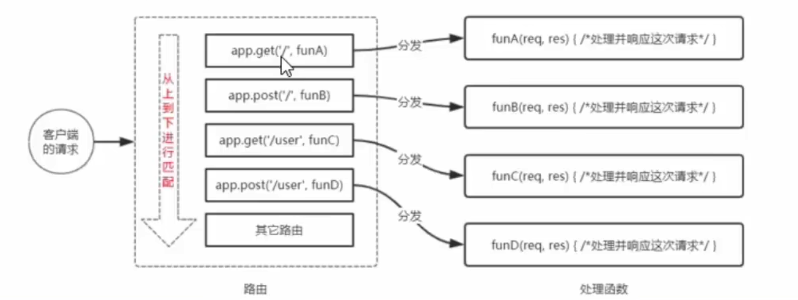

**简单用法**

在Express中，路由最简单的用法就是把路由挂载到app上，

```js
app.get('/', (req, res) => res.send('get request!'))
app.post('/', (req, res) => res.send('post request!'))
```

**模块化路由**

为了方便对路由进行模块化管理，Express不建议将路由直接挂载到app上，而是推荐将路由抽离为单独的模块。

将路由抽离为单独的模块的步骤：

1.创建路由模块对应的js文件

2.调用`express.Router()`创建路由对象

3.向路由对象挂载具体的路由

4.使用`module.exports`向外共享路由对象

5.使用`app.use()`函数注册路由模块

**创建路由模块**

```js
import express from 'express'

// 创建路由对象
const router = express.Router()

// 挂载具体的路由
router.get('/user/list', (req, res) => {
    res.send('get user list')
})

router.post('user/id', (req, res) => {
    res.send('get user info')
})

// 向外导出路由对象
export default router
```

**注册路由模块**

```js
import express from 'express'
import router from './router'

// 创建服务器
const app = express()

// 注册路由模块
app.use(router)

// 启动服务器
app.listen(80, () => {
    console.log('express server is running at 127.0.0.1')
})
```

**为路由模块添加前缀**

类似于托管静态资源时，为静态资源统一挂载访问前缀一样，路由模块添加前缀类似

```js
app.use('/api', router)
```

### Express中间件

**中间件概念**

中间件(Middleware)，特指业务流程的中间处理环节。

**Express中间件的处理流程**

当一个请求到达Express服务器之后，可以连续调用多个中间件，从而对这次请求进行预处理。

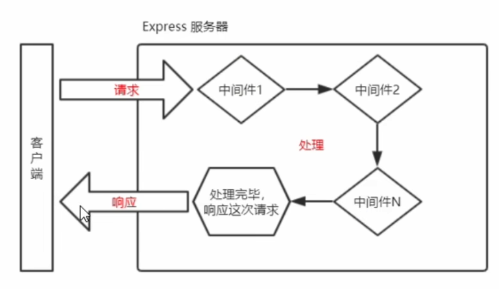

**Express中间的格式**

Express中间件，本质上就是一个处理函数，格式如下：

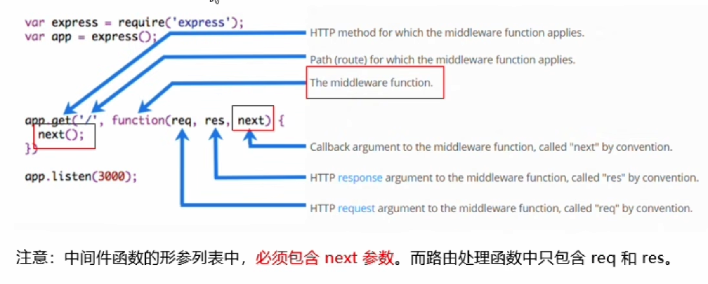

**next函数作用**

next函数是实现多个中间件连续调用的关键，它表示把流转关系转交给下一个中间件或者路由。

**定义中间件函数并使中间件全局生效**

```js
// 创建服务器
const app = express()

// 定义简单的中间件函数
const mw = function(req, res, next) {
    console.log('This is a simple middleware.')
    // 把流转关系转交给下一个中间件或路由
    return next()
}
// 全局生效的中间件
app.use(mw)

app.get('/', (req, res) => {
    console.log('home page')
    res.send('home page!')
})

app.get('/user', (req, res) => {
    console.log('user page')
    res.send('user page')
})

// 启动服务器
app.listen(80, () => {
    console.log('express server is running at 127.0.0.1')
})
```

**中间件的作用**

多个中间件，共享同一份req和res，基于这样的属性，我们可以在上游的中间件中，统一为req和res对象添加自定义属性或者方法，供下游的中间件或者路由使用。

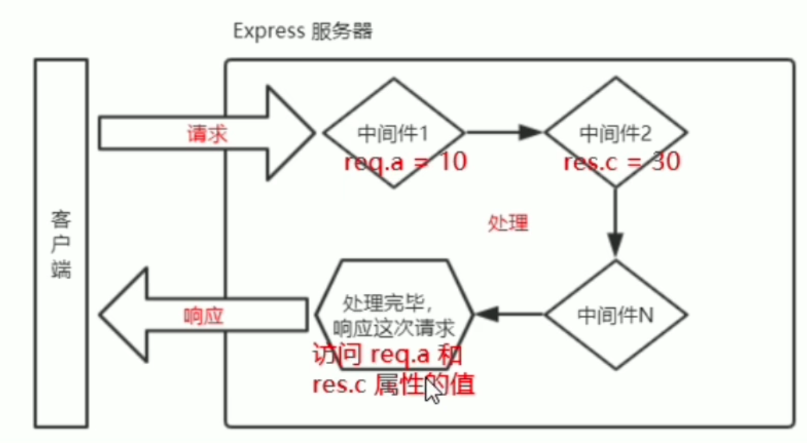


```js
// 定义简单的中间件函数
app.use(function(req, res, next) {
    // 为req自定义time属性，供下游的中间件或者路由使用
    const time = Date.now()
    req.startTime = time
    return next()
})

app.get('/', (req, res) => {
    res.send('home page:' + req.startTime)
})

app.get('/user', (req, res) => {
    res.send('user page:' + req.startTime)
})
```

**定义多个全局中间件**

可以使用`app.use()`连续定一个多个全局中间件，客户端请求到达服务器之后，会按照中间件添加的顺序依次调用。

**局部生效的中间件**

不使用`app.use`定义的中间件，就是局部生效的中间件。

```js
const mw1 = (req, res, next) => {
    console.log('局部中间件')
    return next()
}

app.get('/', mw1,  (req, res) => {
    res.send('home page:' + req.startTime)
})
```

**定义多个局部生效的中间件**

```js
const mw1 = (req, res, next) => {
    console.log('局部中间件1')
    return next()
}
const mw2 = (req, res, next) => {
    console.log('局部中间件2')
    return next()
}

app.get('/', mw1, mw2, (req, res) => {
    res.send('home page:')
})


app.get('/user', [mw1, mw2], (req, res) => {
    res.send('user page:' + req.startTime)
})
```

**中间件的5个注意事项**

* 一定要在路由之前注册中间件
* 客户端发过来的请求，可以连续调用多个中间件进行处理
* 执行完中间件的业务代码后，不要忘记调用next函数
* 为了防止代码逻辑混乱，我们在调用完next函数后，就不要写代码了
* 连续调用多个中间件时，多个中间件之间是共享req和res对象的

### 中间件的分类

为了方便大家理解和记忆中间件的用法，Express官方把常用的中间件分为了5大类，分别是：

* 应用级别的中间件
* 路由级别的中间件
* 错误级别的中间件
* Express内置的中间件
* 第三方的中间件

**应用级别的中间件**

通过`app.use`,`app.get`,`app.post`绑定到app实例上的中间件，叫做应用级别的中间件。

```js
app.get('/', mw1, mw2, (req, res) => {
    res.send('home page:')
})
```

**路由级别的中间件**

绑定到`express.Router()`实例上的中间件，叫做路由级别的中间件。它的用法和应用级别的中间件没有任何区别，只不过应用级别的中间件是绑定到app上，而路由级别的中间件是绑定到router上。

```js
// 挂载具体的路由
router.get('/user/list', (req, res) => {
    res.send('get user list')
})
```

**错误级别的中间件**

错误级别中间件的作用：专门用于捕获整个项目中发生的异常错误，从而防止项目异常崩溃的问题。

格式：错误级别的中间件处理函数中，必须有4个参数，形参顺序从前往后分别是(err, req, res, next).

```js
app.get('/', mw1, mw2, (req, res) => {
    throw new Error('服务器发生了错误')
    res.send('home page:')
})

// 定义错误级别的中间件，捕获整个项目的异常，防止奔溃
app.use((err, req, res, next) => {
    console.log('发生了错误' + err.message)
    res.send(err.message)
})
```

**注意：错误级别的中间件，必须写在所有路由之后，否则无法捕获在其后面的路由的报错**

**Express内置的中间件**

从Express 4.16.0版本后，express提供了3个常用的内置中间件

* `express.static` 快速脱管静态资源的内置中间件。例如html, css,图片等
* `experss.json` 解析JSON格式的请求体数据
* `express.urlencoded` 解析url-encoded格式的请求体数据

**express.json**

解析JSON格式的请求体数据

```js
// 除了错误级别的中间件，其他的中间件必须写在路由之前
app.use(express.json());
app.get('/user', [mw1, mw2], (req, res) => {
    // 服务端可以通过req.body拿到客户端请求body中的数据
    // 默认情况下，如果服务端不设置解析表单数据的中间件，则req.body默认等于undefined
    console.log(req.body)
    res.send('user page')
})
```

**express.urlencoded**

解析url-encoded格式的请求体数据

```js
app.use(express.urlencoded({ extended: false }));

app.post('/book', (req, res) => {
    console.log(req.body)
    res.send('book')
})
```

**第三方中间件**

非express官方内置的，第三方开发出来的中间件，叫做第三方中间件。

例如，在epxress4.16.0版本之前常用的第三方中间件`body-parser`，来解析请求体数据。

使用第三方中间件的步骤：

* `npm install body-parser`
* 导入中间件
* `app.use()`注册中间件

```js
import parser from 'body-parser'
app.use(parser.urlencoded({extended: false}))
app.post('/book', (req, res) => {
    console.log(req.body)
    res.send('book')
})
```

**注意：Express内置的express.urlencoded中间件，就是基于body-parser这个中间件进一步封装出来的**

### 自定义中间件

手动模拟一个类似于express.urlencoded这样的中间件，来解析客户端POST请求提交到服务器的表单数据。

* 定义中间件
* 监听req的data事件
* 监听req的end事件
* 使用querystring模块来解析请求体数据
* 将解析出来的对象挂载为req.body上
* 将自定义中间件封装为模块

**监听req的data事件**

在中间件中，需要监听req的data事件，来获取客户端发送到服务端的数据。

如果数据量比较大，无法一次发送完毕，则客户端会把数据切割后，分批发送到服务器。所以data事件可能会触发多次，每一次出发data事件时，获取到数据只是完整数据的一部分，需要手动对接收到的数据进行拼接。

**监听req的end事件**

当请求体数据接收完毕后，会自动触发req的end事件。因此，我们可以在req的end事件中拿到完整的请求体数据。

```js
let str = "";
// 监听req的data事件，拼接客户端发送过来的请求体数据
req.on("data", (chunk) => {
  str += chunk;
});
```

**使用querystring模块解析请求体数据**

nodejs中内置了一个`querystring`模块，专门用于处理查询字符串。通过这个模块提供的parse函数，可以轻松的查询字符串，解析成对象格式。

**将解析出来的数据对象挂载为req.body**

上游的中间件以及下游的中间件以及路由之间，共享一份req和res，因此，我们可以将解析出来的数据，挂载为req的自定义属性，命名为`req.body`,供下游使用。

```js
app.use((req, res, next) => {
    let str = "";
    // 监听req的data事件，拼接客户端发送过来的请求体数据
    req.on("data", (chunk) => {
      str += chunk;
    });
    // 见提供req的end事件
    req.on('end', () => {
      console.log(str);
      // 使用querystring模块中的parse方法，把查询字符串解析为对象
      const body = querystring.parse(str)
      console.log(body)
      req.body = body
      next()
    })
    
})

app.post('/book', (req, res) => {
    res.send(req.body)
})
```

**将自定义中间件封装为模块**

```js
import querystring from 'querystring'

const bodyParser = (req, res, next) => {
  let str = "";
  // 监听req的data事件，拼接客户端发送过来的请求体数据
  req.on("data", (chunk) => {
    str += chunk;
  });
  // 见提供req的end事件
  req.on("end", () => {
    console.log(str);
    // 使用querystring模块中的parse方法，把查询字符串解析为对象
    const body = querystring.parse(str);
    console.log(body);
    req.body = body;
    next();
  });
};

export default bodyParser
```

### 使用Express编写接口

**创建基本的服务器**

```js
// 导入
import express from 'express'

// 创建服务器
const app = express()


// 启动服务器
app.listen(80, () => {
    console.log('express server is running at 127.0.0.1')
})
```

**创建API路由模块**

```js
// apiRouter.js
import { Router } from 'express'

// 创建路由模块
const apiRouter = Router()

// 导出路由模块
export default apiRouter
```

```js
// index.js
// 导入
import express from 'express'
import apiRouter from "./apiRouter.js";

// 创建服务器
const app = express()

// 导入并注册路由模块
app.use('/api', apiRouter)

// 启动服务器
app.listen(80, () => {
    console.log('express server is running at 127.0.0.1')
})
```

**编写GET接口**

```js
apiRouter.get('/get', (req, res) =>{
    // 获取客户端的查询字符串
    const query = req.query
    // 服务器向响应客户端
    res.send({
        stats: 0, // 0表示成功，1表示失败
        message: 'get请求成功', // 状态描述消息
        data: query // 需要响应客户端的具体数据
    })
})
```

**编写POST接口**

```js
// apiRoute.js
apiRouter.post('/post', (req, res) => {
    // 获取客户端的请求体数据
    const body = req.body
    // 响应客户端
    res.send({
        status: 0,
        message: 'post请求成功',
        data: body
    })
})
```

```js
// index.js
// 配置解析表单数据的中间件
app.use(express.urlencoded({extended: false}))
```

### CORS跨域资源共享

**接口的跨域问题**

刚才编写的GET和POST接口，存在一个严重的问题，不支持跨域请求。

解决接口跨域问题的方案有两种：

* CORS（主流的解决方案，推荐）
* JSONP（有缺陷的解决方案，只支持GET请求）

```js
// index.html
<!DOCTYPE html>
<html lang="en">
  <head>
    <meta charset="UTF-8" />
    <meta name="viewport" content="width=device-width, initial-scale=1.0" />
    <title>Document</title>
  </head>
  <body>
    <button id="btnGET">GET</button>
    <button id="bntPOST">POST</button>
  </body>

  <script
    src="https://code.jquery.com/jquery-3.7.1.js"
    integrity="sha256-eKhayi8LEQwp4NKxN+CfCh+3qOVUtJn3QNZ0TciWLP4="
    crossorigin="anonymous"
  ></script>

  <script>
    $("#btnGET").on("click", function () {
      $.ajax({
        method: "get",
        url: "http://127.0.0.1/api/get",
        data: {
          name: "zs",
          age: 18,
        },
        success: (data) => {
          console.log(data);
        },
      });
    });

    $("#bntPOST").on("click", function () {
      $.ajax({
        method: "post",
        url: "http://127.0.0.1/api/post",
        data: {
          name: "zs",
          age: 18,
        },
        success: (data) => {
          console.log(data);
        },
      });
    });
  </script>
</html>
```

**使用cors中间件解决跨域问题**

cors时express的一个第三方中间件，通过安装和配置cors中间件，可以很方便的解决跨域问题

使用步骤

* `npm i cors`
* `import cors from 'core'`
* 注册中间件，`app.use(cors())`

```js
//index.js
// 导入
import express from "express";
import apiRouter from "./apiRouter.js";
import cors from "cors";

// 创建服务器
const app = express();

// 配置解析表单数据的中间件
app.use(express.urlencoded({ extended: false }));

app.use(cors());

// 导入并注册路由模块
app.use("/api", apiRouter);

// 启动服务器
app.listen(80, () => {
  console.log("express server is running at 127.0.0.1");
});
```

**跨域资源共享**

CORS(cross-origin Resource Sharing，跨域资源共享), 由一系列http响应头组成，这些http响应头决定浏览器是否阻止前端js代码跨域获取资源。

浏览器的同源安全策略默认会组织网页跨域获取资源，但是如果服务器配置了CORS相关的HTTP响应头，就可以解除浏览器的跨域访问限制。

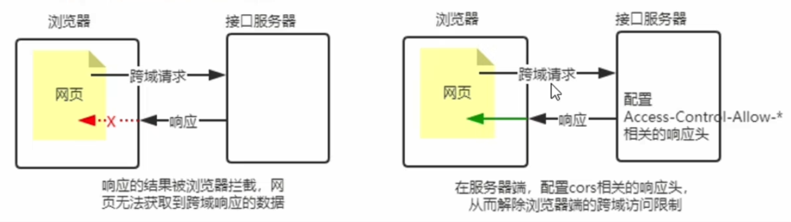

**CORS的注意事项**

* CORS在服务端进行配置，客户端浏览器无需做任何额外的配置，即可请求开启了CORS的接口。
* CORS在浏览器中有兼容性，只有支持XMLHttpRequest Level2的浏览器，才能正常访问开启了CORS的服务器接口。

**CORS响应头**

* `Access-Control-Allow-Origin`

响应头部可以携带一个`Access-Control-Allow-Origin`字段，语法如下

```shell
Access-Control-Allow-Origin: <origin> | *
```

其中，origin参数值指定了允许访问该资源的外域URL。

例如，下面的字段值只允许来之`http://itcat.cn`的请求。

```js
res.setHeader('Access-Control-Allow-Origin', 'http://itcat.cn')
```

如果指定了`Access-Control-Allow-Origin`的字段值为*，则表示允许来自任何域的请求。

```js
res.setHearder('Access-Control-Allow-Origin', *)
```

* `Access-Control-Allow-Headers`

默认情况下，CORS仅支持客户端向服务器发送如下的9个请求头：

```test
Accept, Accept-Language, Content-Lauguage, DPR, Downlink, Save-Data, ViewPort-Width, Witdh, Content-Type(值仅限于text/plain, multipart/form-data, application/x-www-form-urlencoded三者之一)
```

如果客户端向服务器发送了额外的请求头信息，则需要在服务器端，通过`Access-Control-Allow-Headers`对额外的请求头进行声明，否则这次请求会失败。

```js
// 允许客户端向服务器发送 Content-Type 请求头和 X-Customer-Header请求头
// 注意：多个请求头之间使用英文逗号进行分隔
res.setHeader('Access-Control-Allow-Headers', 'Content-Type, X-Customer-Header')
```

* `Access-Control-Allow-Methods`

默认情况下，CORS仅支持客户端发起GET，POST，HEAD请求

如果客户端希望通过PUT、DELETE等方式请求服务器的资源，则需要在服务器端，通过`Access-Control-Allow-Methods`来指明实际请求所允许使用的HTTP方法。

```js
// 只允许POST、GET、PUT、DELETE请求方法
res.setHeader('Access-Control-Allow-Methods', 'POST, GET, PUT, DELETE')
// 允许所有的HTTP请求方法
res.setHeader('Access-Control-Allow-Methods', *)
```

**CORS的请求分类**

客户端在请求CORS接口时，根据请求方式和请求头的不同，可以将CORS的请求分为两大类：

* 简单请求
* 预检请求

**简单请求**

同时满足以下两大条件的请求，即为简单请求

1. 请求方式为GET、POST、HEAD三者之一
2. HTTP头部信息不超过以下几种字段：无自定义头部字段，Accept, Accept-Language, Content-Lauguage, DPR, Downlink, Save-Data, ViewPort-Width, Witdh, Content-Type(值仅限于text/plain, multipart/form-data, application/x-www-form-urlencoded三者之一)

**预检请求**

只要符合以下条件中的任意一个，都需要进行预检请求：

1. 请求方式为GET、POST、HEAD三种请求方式外的请求
2. 请求头中包含自定义请求头部字段
3. 向服务器发送了`application/json`格式的数据

 在浏览器和服务器正式通信之前，浏览器会先发送OPTION请求进行预检，以获知服务器是否允许该实际请求，所以这一次的OPTION请求称为“预检请求”。服务器成功响应预检请求后，才会发送真正的请求，并且携带真实数据。

**简单请求和预检请求的区别**

简单请求的特点：客户端和服务端只会发生一次请求。

预检请求的特点：客户端和服务端会发生两次请求，OPTION预检请求成功后，，才会发起真正的请求。

**JSONP请求**

* JSONP的概念和特点

概念：

浏览器通过script标签的src属性，请求服务器上的数据， 同时服务器返回一个函数的调用，这种请求数据的方式称为JSONP。

特点：

1. JSONP不属于真正的Ajax请求，因为它没有使用XMLHttpRequest这个对象
2. JSONP只支持GET请求，不支持POST、GET、DELETE等请求

* 创建JSONP接口的注意事项

如果项目中已经配置了CORS（跨域资源共享），为了防止冲突，必须在配置CORS中间件之前声明JSONP的接口，否则JSONP的接口会被处理成开启了CORS的接口。

```js
// index.js
app.get("/api/jsonp", (req, res) => {
  // JSONP接口的具体实现
  // 1.获取客户端发送的回调函数名
  const funname = req.query.callback;
  // 2.组装发送给客户端的数据
  const data = { name: "zs", age: 18 };
  // 3.拼接函数调用的字符串
  const scriptStr = `${funname}(${JSON.stringify(data)})`;
  // 4.响应客户端
  res.send(scriptStr);
});
app.use(cors());
```

* 实现JSONP接口的步骤

1. 获取客户端发送过来的回调函数的名字
2. 得到要通过JSONP形式发送给客户端的数据
3. 根据前两步得到的数据，拼接一个函数调用的字符串
4. 把上一步拼接得到的字符串，响应给客户端的<script>标签进行解析执行

```js
$("#btnJSONP").on("click", function () {
  $.ajax({
    method: "get",
    url: "http://127.0.0.1/api/jsonp",
    dataType: "jsonp",
    success: (res) => {
      console.log(res);
    },
  });
});
```

## 数据库

**目录**

* 数据库的基本概念
* 安装并配置MySQL
* MySQL的基本使用
* 在Express中操作MySQL
* 前后端的身份认证

### 数据库的基本概念

**数据库**

用来组织、存储和管理数据的仓库。

**常见的数据库和分类**

常见的数据库有以下几类：

* MySQL数据库（目前使用最广泛、流行度最高的开源免费数据库；Community + Enterprise）
* Orancle数据库（收费）
* SQL Server数据库（收费）
* Mongodb数据库（Communi + Enterprise）

其中MySQL，Orancle以及SQL Server属于传统型数据库（又叫做关系型数据库或SQL数据库），这三者的设计理念相同，用法比较类似；

而Mongodb属于新型数据库（又叫做非关系型数据库或NoSQL数据库），他在一定程度上弥补了传统数据库的缺陷。

**传统数据库的数据组织结构**

数据的组织结构：指的是数据以什么样的结构进行存储

传统数据库的结构和Excel类似，我们可以对比Excel的数据存储方式来比较。

在Excel中，数据的组织结构分为工作簿、工作表、数据行和列这4大部分组成。

而在传统的数据库中，数据库的结构分为数据库（database）、数据表（table）、数据行（row）和字段（field）这4部分组成。

**实际开发中库、表、行和字段之间的关系**

* 实际项目开发中，一般情况下，每个项目都对应一个独立的数据库
* 不同的数据，要存储到数据库的不同的表中
* 每个表中具体存储哪些数据，是由字段来决定
* 表中的行，代表一条具体的数据

### 安装并配置MySQL数据库

对于开发人员来说，只需要安装MySQL Server和MySQL Workbench这两个软件

* MySQL Server：专门用来提供数据存储和服务的软件
* MySQL Workbench：可视化的MySQL管理工具，可以方便的操作存储在MySQL Server中的数据

### MySQL的基本使用

**使用MySQL Workbench管理数据库**

**连接数据库**

打开MySQL workbench后输入root 密码，链接到数据库。

**创建数据库**

注意：切换从admistration切换到schems栏。

点击创建数据库的图表，输入数据库名并且apply。

**创建数据表**

选择对应的数据库下面的table，右键点击创建table，如何table的名字和描述，然后添加数据表的字段，可以为字段添加描述，说明字段的作用。

**字段的标识**

PK：Primary Key， 主键，唯一标识

NN：Not Null，值不允许为空

UQ：Unique，值为一

AI：Auto Increament，值自动增长

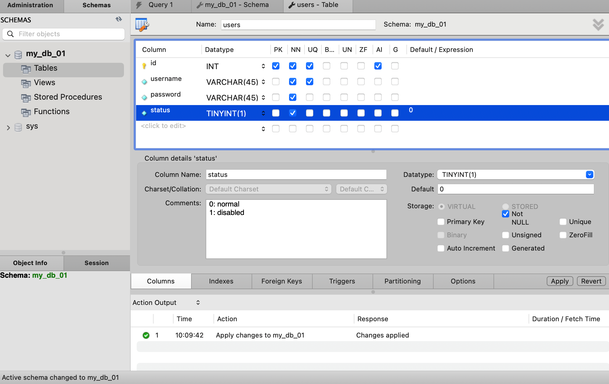

**向表里面插入数据**

选择table名，右键单击`select rows limit 1000`,然后输入对应的用户名和密码即可，id和status会自动填充。

**使用SQL管理数据库**

**什么是SQL**

SQL（Structured Query Lanuage）是结构化查询语言，专门用来访问和管理数据库的编程语言。能够让我们以编程的形式操作数据库里面的数据。

关键点

* SQL是一门数据库编程语言
* 使用SQL语言编写出来的代码，叫做SQL语句
* SQL语言只能在关系型数据库中使用（例如MySQL，Orancle，SQL Server）。非关系型数据库（例如Mongodb）不支持SQL语言。

**SQL的SELECT语句**

* 语法

```sql
-- *表示所有列
SLECT * FROM 表名
-- 可以查询指定列
SELECT 列名称 FROM 标名
```

**SQL的INSERT INTO语句**

* 语法

INSERT INTO语句用于向数据库表中插入新的数据行

```sql
INSERT INTO table_name (colum1, colum2...) VALUES (value1, value2...)
```

```sql
INSERT INTO users (username, password) VALUES ("Derric", "123")
```

**SQL的UPDATE语句**

* 语法

UPDATE用于更新表中的数据

```sql
UPDATE table_name SET column_name = new_value WHERE column_name = value
```

* 更新某一行的某一个列

```sql
UPDATE users SET username = "Matt2" WHERE username="Matt"
```

* 更新某一行的多个列

```sql
UPDATE users SET username="Matt3", password="234" WHERE username="Matt2"
```

**SQL的DELETE语句**

* 语法

DELETE语句用于删除表中的行。

```sql
DELETE FROM table_name WHERE column_name=column_value
```

```sql
DELETE FROM users WHERE id=2
```

**SQL的WHERE子句**

WHERE字句用于限定选择的标准。在SELECT、UPDATE、DELETE语句中均可使用WHERE子句。

* 可以在WHERE子句中使用的运算符

下面的运算符可以在WHERE字句中使用，限定选择的标准

| 操作符  | 描述         |
| ------- | ------------ |
| =       | 等于         |
| <>      | 不但于       |
| >       | 大于         |
| <       | 小于         |
| >=      | 大于等于     |
| <=      | 小于等于     |
| BETWEEN | 在某个范围内 |
| LIKE    | 搜索某种格式 |

**注意：在某些版本的SQL语句中，<>也可以写成!=**

```sql
SELECT * FROM users WHERE id=1
SELECT * FROM users WHERE id!=1
```

**SLECT的AND和OR运算符**

* 语法

AND和OR可以在WHERE子句中，把两个或者多个条件语句结合起来。

AND表示必须同时满足多个条件。

OR表示只要满足任意一个条件即可。

 ```sql
 SELECT * FROM users WHERE id<=3 AND status=0
 SELECT * FROM users WHERE id=1 OR status=1
 ```

**SQL的ORDER BY 字句**

ORDER BY子句用于根据指定的列对结果进行排序。

ORDER BY默认按照升序对结果进行排序。

如果希望按照降序对结果进行排序，可以使用`DESC`关键字。

```sql
SELECT * FROM users ORDER BY id
SELECT * FROM users ORDER BY id DESC
```

**ORDER BY子句-多重排序**

```sql
SELECT * FROM users ORDER BY status, username DESC
```

**SQL的COUNT(*)函数**

* 语法

COUNT(*)用于返回查询结果的总数据条数

```sql
SELECT COUNT(*) FROM table_name
```

```sql
SELECT COUNT(*) FROM users WHERE status=0
```

**使用AS为列设置别名**

```sql
SELECT COUNT(*) AS total FROM users WHERE status=0
```

### 在项目中操作MySQL数据库

**步骤**

1. 安装MySQL数据库的第三方模块mysql
2. 通过mysql模块连接到MySQL数据库
3. 通过mysql模块执行SQL语句

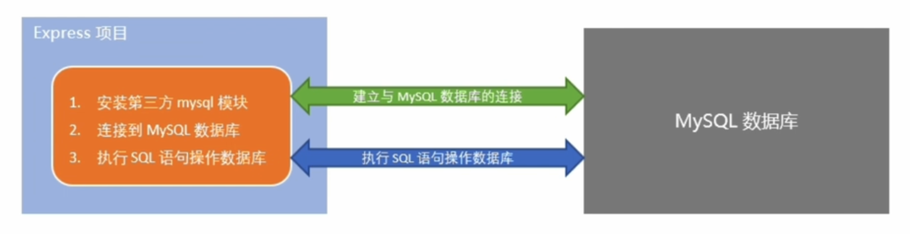

**安装mysql模块**

```shell
npm i mysql
```

**配置mysql模块**

要使用mysql操作MySQL数据库，必须对mysql模块进行必要的配置。

```js
import { createPool } from "mysql";
const db = createPool({
  host: "127.0.0.1",
  user: "root",
  password: "***",
  database: "my_db_01",
});
```

**测试mysql模块是否正常工作**

调用`db.query`函数，指定要执行的SQL语句，通过回调函数拿到执行结果。

```js
db.query("SELECT 1", (err, result) => {
  if (err) {
    return console.log(err.message);
  }
  console.log(result);
});
//[ RowDataPacket { '1': 1 } ]
```

**查询数据**

```sql
const sqlStr = "SELECT * FROM users";
db.query(sqlStr, (err, results) => {
  if (err) {
    return console.log(err.message);
  }
  // 如果执行的是查询语句，那么results是一个数组
  console.log(results);
});

/*
[
  RowDataPacket {
    id: 1,
    username: 'Matt3',
    password: '234',
    status: 0
  },
  RowDataPacket {
    id: 3,
    username: 'Derric',
    password: '123',
    status: 1
  },
  RowDataPacket { id: 4, username: 'ls', password: '123', status: 0 }
]
*/
```

**插入数据**

```js
const user = { username: "Spider-man", password: "pdf212" };
const strSql = "INSERT INTO users (username, password) VALUES (?, ?)";
db.query(strSql, [user.username, user.password], (err, result) => {
  if (err) {
    return console.log(err.message);
  }
  // 如果执行的是插入语句，则result是一个对象，包含affectedRows属性
  if (result.affectedRows === 1) {
    console.log("insert data successfully!");
  }
});
```

**插入数据的快捷方式**

插入数据时，如果数据对象的每个属性和数据表的字段一一对应，则可以通过以下方式插入数据

```js
const user = { username: "Spider-man2", password: "pdf212" };
// 待执行的SQL语句，其中？表示占位
const sqlStr = "INSERT INTO users SET ?";
db.query(sqlStr, user, (err, result) => {
  if (err) {
    return console.log(err.message);
  }
  if (result.affectedRows === 1) {
    console.log("insert data successfully!");
  }
});
```

**更新数据**

```js
const user = { id: 7, username: "aaa", password: "000" };
const sqlStr = "UPDATE users SET username=?, password=? WHERE id=?";
db.query(sqlStr, [user.username, user.password, user.id], (err, result) => {
  if (err) {
    return console.log(err.message);
  }
  if (result.affectedRows === 1) {
    console.log("upodate data successfully!");
  }
});
```

**更新数据的快捷方式**

插入数据时，如果数据对象的每个属性和数据表的字段一一对应，则可以通过以下方式插入数据

```js
const user = { id: 7, username: "aaaa", password: "0000" };
const strSql = "UPDATE users SET ? WHERE id=?";
db.query(strSql, [user, user.id], (err, result) => {
  if (err) {
    return console.log(err.message);
  }
  if (result.affectedRows === 1) {
    console.log("update data successfully!");
  }
});
```

**删除数据**

在删除数据时，推荐是id这样的唯一标识符来删除数据

```js
const sqlStr = "DELETE FROM users WHERE id=?";
// 如果sql语句中只有一个占位符，可以省略数组
// 如果sql语句有多个占位符，则必须使用数组为每个占位符指定具体的值
db.query(sqlStr, 7, (err, result) => {
  if (err) {
    return console.log(err.message);
  }
  if (result.affectedRows === 1) {
    console.log("delete data successfully!");
  }
});
```

**标记删除**

使用DELETE语句，会把真正的数据从表中删除。为了保险起见，推荐使用标记删除的方式，来模拟删除的动作。

所谓的标记删除，就是在表中设置类似于status这样的字段，来标记这条记录是否被删除。

当用户执行了删除的动作时，我们没有执行DELETE语句把数据删除掉，而是执行了UPDATE语句，将这条记录对应的status字段标记为删除即可。

```js
const sqlStr = "UPDATE users SET status=? WHERE id=?";
db.query(sqlStr, [1, 5], (err, result) => {
  if (err) {
    return console.log(err.message);
  }
  if (result.affectedRows === 1) {
    console.log("delete softly");
  }
});
```

### 前后端的身份认证

**Web开发模式**

目前主流的开发模式主要有两种：

* 基于服务端渲染的传统web开发模式
* 基于前后端分离的新型web开发模式

**服务端渲染的Web开发模式**

服务端渲染的概念：服务端发送给客户端的HTML页面，是在服务器通过字符串的拼接，动态生成的。因此，客户端不需要使用Ajax这样的技术额外请求页面的数据。

服务端渲染的优缺点

优点：

* 前端耗时少。因为服务端负责动态生成HTML内容，浏览器只需要直接渲染页面即可，尤其是移动端，更省电。
* 有利于SEO。因为服务端响应的是完整的HTML页面内容，所以爬虫更容易爬取获得信息，有利于SEO。

缺点：

* 占用服务器端资源。即服务器端完成HTML页面内容的拼接，如果请求较多，会对服务器造成一定的压力。
* 不利于前后端分离，开发效率低。使用服务器端渲染，则无法进行分工合作，尤其对于前端复杂度较高的项目，不利于项目高效开发。

**前后端分离的Web开发模式**

前后端分离的概念：前后端分离的开发模式，依赖于Ajax技术的广泛应用。简而言之，前后端分离的开发模式，就是后端只提供API接口，前端使用Ajax调用接口的开发模式。

前后端分离的优缺点

优点：

* 开发体验好。前端专注于UI页面的开发，后端专注于api的开发，且前端有更多的选择性。
* 用户体验好。Ajax技术的广泛应用，极大的提高了用户的体验，可以轻松实现页面的局部刷新。
* 减轻了服务器端的渲染压力。因为页面最终是在每个用户的浏览器生成的。

缺点：

* 不利于SEO。因为完整的HTML页面需要在客户端动态拼接完成，所以爬虫无法爬取页面的有效信息。（解决方案：利用Vue，React等前端框架的SSR（server side render）技术能够很好的解决SEO问题）

**如何选择Web开发模式**

不谈业务场景而盲目选择使用何种开发模式的都是耍流氓。

* 比如企业级官网，主要功能是展示而没有复杂的交互，并且需要良好的SEO，则这时我们就需要使用服务器端渲染。
* 而类似后台管理项目，交互性比较强，不需要考虑SEO，那么就可以使用前后端分离的开发模式。

另外，具体使用何种开发模式也不是绝对的，为了同时兼顾首页的渲染速度和前后端分离的开发效率，一些网站采用了首屏服务器渲染 + 其他页面前后端分离的开发模式。

**身份认证**

身份认证又称身份验证，鉴权，是指通过一定的手段，完成对用户身份的确认。

**不同开发模式下的身份认证**

对于服务端渲染和前后端分离这两种开发模式来说，分别有不同的认证方案：

* 服务端渲染推荐使用Session认证机制
* 前后端分离推荐使用JWT认证机制

**Session认证机制**

* HTTP的无状态机制

HTTP协议的无状态性，指的是客户端的每次HTTP请求都是独立的，连续多次请求之间没有直接的关系，服务端不会主动保留每次HTTP请求的状态。

* 如何突破HTTP的无状态限制

在web开发中会使用Cookie的方式，颁发一个身份标识给到客户端，客户端在每次请求的时候要携带这个Cookie。

**什么是Cookie**

Cookie是一段存储在浏览器中的不超过4KB的字符串。它有一个名称（name），一个值（value）和几个用于控制Cookie的有效期，安全性和适用范围的可选属性组成。

不同域名下的Cookie是相互独立的，每当客户端发送请求时，会把当前域名下所有未过期的Cookie一同发送到服务器端。

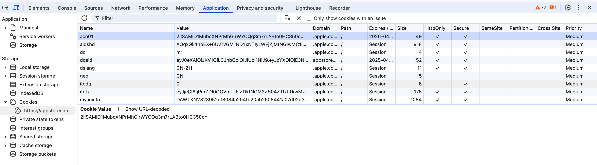

**Cookie的特性**

* 自动发送
* 域名独立
* 过期时限
* 4KB限制

**Cookie在身份认证中的作用**

客户端第一次请求服务器的时候，服务器通过响应头的形式，向客户端发送一段身份验证的Cookie，客户端会自动将Cookie保存到浏览器中。

随后，当客户端浏览器每次请求服务器的时候，浏览器会自动将身份认证的Cookie，通过请求头的形式发送给服务器，服务器即可验明客户端的身份。


**Cookie不具有安全性**

由于Cookie是存储在浏览器中的，而且浏览器也提供了读写Cookie的API，因此Cookie很容易被伪造，不具有安全性。因此不建议服务器将重要的隐私数据，通过Cookie的形式发送给浏览器。

**注意：千万不要使用Cookie存储重要且隐私的数据！比如用户的身份信息，密码等。**

**提高身份认证的安全性**

为了防止客户伪造会员卡，收银员在拿到客户端出示的会员卡后，会进行刷卡认证，只有被收银机认证的会员卡，才能被正常使用。

这种会员卡+刷卡认证的设计理念，就是Session认证机制的精髓。

**Session的工作原理**

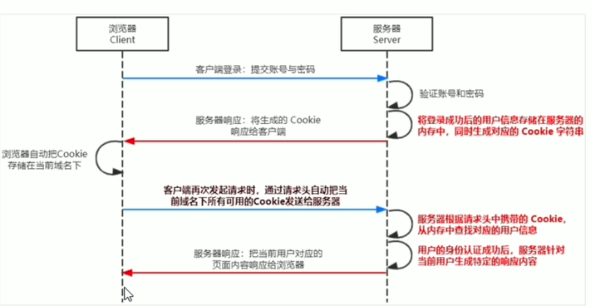

**在Express中使用Session认证**

使用`express-session`中间件来实现Session的认证

步骤：

1. 安装`express-session`中间件

```shell
npm i express-session
```

2. 引入该中间件
3. 注册session中间件

```js

import session from 'express-session'
...
app.use(session({
  secret: 'itcast',
  resave: false, //固定写法
  saveUninitialized: true //固定写法
}))
```

**如何向session里面存数据**

当`express-session`配置成功后，即可通过`req.session`来访问和使用session对象。

```js
apiRouter.post('/login', (req, res) => {
  //判断用户提交的信息是否正确
  if (req.body.username != 'admin' || req.body.password !== '000') {
    res.send({
      status: 1,
      msg: 'faild to log in!'
    })
  }
  // 注意：只有配置了experss-session中间件后，req.session这个对象才存在
  req.session.user = req.body // 用户信息
  req.session.isLogin = true // 用户登录状态
  res.send({
    status: 0,
    msg: 'log in successfully!'
  })
})
```

**从session中取数据**

可以直接从`req.session`对象中获取之前存储的数据。

**清空session**

调用`req.session.destroy`函数，可以清空服务器保存的session信息。

**注意：调用这个方法，只会清空当前用户对应的session，不会清空其他用户的session信息。**

```js
apiRouter.post('/logout', (req, res) => {
  req.session.destroy()
  res.send({
    status: 0,
    msg: 'log out successfully!'
  })
})
```

**JWT认证机制**

* Session认证的局限性

Session认证机制需要配合Cookie才能实现。由于Cookie默认不支持跨域访问，所以，当涉及到前端跨域请求后端接口时，需要做很多额外的配置，才能实现跨域Session认证。

注意：

当前端请求后端接口不存在跨域问题的时候，推荐使用Session认证机制。

当前端需要跨域请求后端接口时，不推荐使用Session身份认证机制，推荐使用JWT认证机制。

* 什么是JWT

JWT（JSON Web Token）是目前最流行的跨域认证解决方案。

* JWT的工作原理

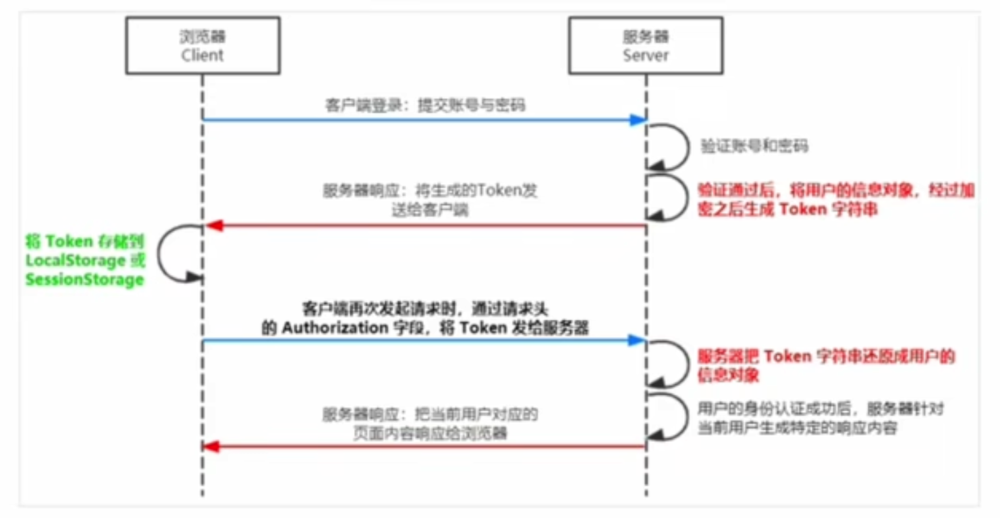

总结：用户的信息通过token的字符串形式，保存在客户端浏览器中，服务端通过还原Token字符串的形式来认证用户的身份。

* JWT的组成部分

JWT通常由三部分组成，分别是Header（头部），Payload（有效载荷），Signature（签名），三者之间使用.分隔。

```text
Header.Payload.Signature
```

```text
eyJhbGciOiJIUzI1NiIsInR5cCI6IkpXVCJ9.
eyJzdWIiOiIxMjM0NTY3ODkwIiwibmFtZSI6IkpvaG4gRG9lIiwiaWF0IjoxNTE2MjM5MDIyfQ.
SflKxwRJSMeKKF2QT4fwpMeJf36POk6yJV_adQssw5c
```

* JWT的三个部分各自代表的含义

JWT的三个组成部分，从前到后分别是Header,Payload和Signature

其中：

Payload才是真正的用户信息，它是用户信息经过加密后生成的字符串；

Header和Signature是安全相关的部分，只是为了保证token的安全性。

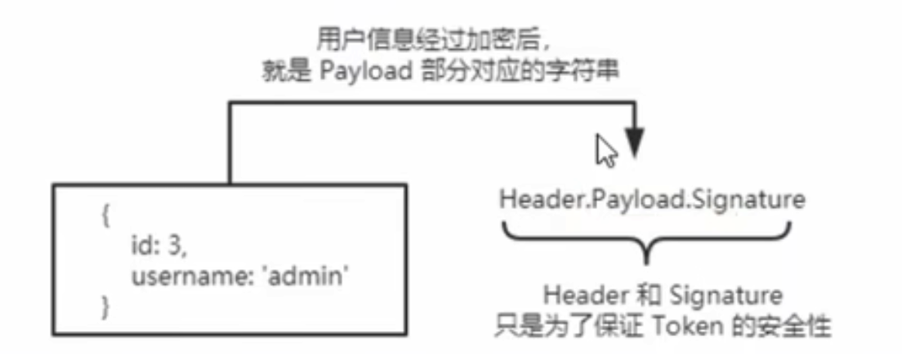

* JWT的使用方式

客户端收到服务端返回的JWT之后，通常会将它存在localStorage或者sessionStorage中。

此后，客户端每次与服务端通信，都会带上这个JWT的字符串，从而进行身份验证。推荐的做法是把JWT放在HTTP的请求头的Authorization字段中，格式如下

```js
Authorization: Bearer <token>
```

* 安装JWT相关的包

```shell
npm i jsonwebtoken express-jwt
```

Jsonwebtoken: 用于生成JWT字符串

express-jwt： 用于将jwt字符串解析还原成JSON对象

* 导入相关包

```js
import jwt from 'jsonwebtoken'
import {expressjwt} from 'express-jwt'
```

* 在Express中使用JWT

定义secret密钥

为了保证JWT字符串的安全性，防止JWT字符串在网络传输过程中被别人破解，我们需要专门定义一个加密和解密的密钥。

1. 当生成JWT字符串的时候，需要使用secret密钥对用户信息进行加密，最终得到加密好的JWT字符串
2. 当把JWT字符串解析还原成JSON对象的时候，需要使用secret密钥进行解密

**在登录成功后生成JWT字符串**

调用jsonwebtoken的sign方法，将用户信息加密生成JWT字符串，响应给客户端。

```js
apiRouter.post("/login", (req, res) => {
  //判断用户提交的信息是否正确
  if (req.body.username != "admin" || req.body.password !== "000") {
    res.send({
      status: 1,
      msg: "faild to log in!",
    });
  }
  const jwtStr = jwt.sign({ username: req.body.username }, secretKey, {
    expiresIn: "30s",
  });
  res.send(jwtStr)
});
```

**注意：千万不要把密码加密到token字符串中，否则有泄漏的危险**

**将JWT字符串还原为JSON对象**

客户端每次在访问那些有权限的接口时，都需要主动通过请求头中的Authorization字段，将token字符串发送到服务器进行身份验证。

此时，服务器可以通过express-jwt这个中间件，自动将客户端发送过来的token字符串解析还原为JSON对象。

```js
// unless表明/api开头的接口都不要进行验证
apiRouter.use(
  expressjwt({
    secret: secretKey,
    algorithms: ["HS256"],
    requestProperty: "user",
  }).unless({ path: /^\/api\// })
);
```

**注意：只能配置成功了express-jwt中间件，就可以把解析出来的用户信息，挂载到req.user属性上，最新版的默认在req.auth上，如果要放到user上，需要配置requestProperty属性指定**

```js
apiRouter.get('/admin/userInfo', (req, res) => {
  console.log(req.user)
  res.send({
    status: 0,
    msg: 'get user info',
    data: req.user
  })
})
```

**捕获解析JWT失败后产生的错误**

当使用express-jwt解析token字符串，如果发送过来的token过期或不合法，会产生一个解析失败的错误，影响项目的正常运行。我们可以通过express的错误中间件，捕获这个错误并进行相关的处理。

```js
apiRouter.use((err, req, res, next) => {
  if (err.name === 'UnauthorizedError') {
    return res.send({
      status: 401,
      msg: 'invalid token'
    })
  }
  res.send({
    status: 500,
    msg: 'unknow issues'
  })
})
```

