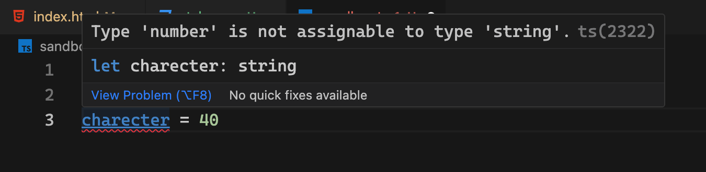
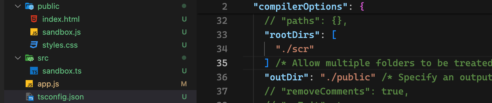
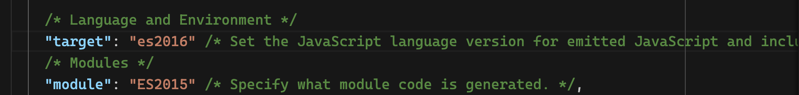
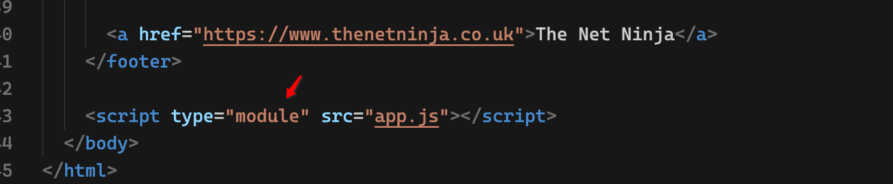

# TypeScript

## Inro

### What is typescript?

TypeScript is a alternative of JavaScript, it's a superset of JavaScript.

### Why does we need the typescript?

If you are a web developer, you know that the JavaScript has some problems. It's a dynamic language, the variables can be changed from one type to another easily. 

With TypeScript, you don't need to worry about this kind of issues. **TypeScript allow us to use strict types.**

The second important of typescript is that you can use the modern features of JavaScript as you like. You know not every browser support the modern features of JavaScript, such as arrow function, let, const.

And the TypeScript also provide some extra specific features, like generics, interface and tuple.

With TypeScript, you can program more easily and more productive. But when you are going to deploy the project which is using TypeScript, you need first compile it into the regular JavaScript, this is also very easy to be done. You just need to download the TypeScript compiler and use it to complete the compilation.


## Compiling TypeScript

We can write codes in a TypeScript file freely, when we are going to deploy it, we first need to compile it into the regular JavaScript. As we mentioned before, we can transform it with the TypeScript compiler more easily .

```shell
tsc <ts file>
```

We can use the top command compile the specific TypeScript to a JavaScript file easily. If the according JavaScript file exists, then the content in the file will be changed accordingly. If not, then it will generate a new JavaScript file with the same name and `.js` extension.

If we want watch the change of the TypeScript file and compile it into the JavaScript file, we can use the below command.

```shell
tsc <ts file> -w
```

The `w` represents watch.


## Type Basics

The main fundamentals between JavaScript and TypeScript is that **TypeScript use strict types**.

As we know, we can change the type of variable to another type easily in regular JavaScript, but we can't do this in TypeScript, this can prevent us making such kind of mistakes.

When you populate a variable with a specific value, the TypeScript will infer the type of the variable, you don't need to explicitly the type. And when you populate it with another kind of value, there will be a red wave line under the variable. Then you know you made some mistakes and you can change it.




## Array & Object

### Array

When we define an array variable and assign it with some values, then the TypeScript will infer the type of this array variable. If you want to assign the array or the array element with another kind of values, then there will be a red squiggly line under the variable and prompt that you can't do that.

### Object

It's similar for object type. If you initialized a variable with an object values, and then you changed the type of some property to another type or add a new property for the object variable, it will also prompt you can't do that.


## Explicit Types

Sometimes we may define a variable without giving it a value, then the TypeScript can't infer what type it is.

Here we need to specify the type of the variable, like below.

```javaScript
let eName: string
eName = 'Matt'
let gender: string
gender = 'man'
let age: number
age = 18

// Array
let arr: string[] = []
arr.push('Matt')

// Union
let mixed: string|number
mixed = 'Matt'
mixed = 18

// Object
let obj: object = {}
obj['name'] = 'Matt'
// As array is also an object, we call also assign an object with a array
// But it's not recommended.
obj = []

let obj2: { 
    name: string,
    gender: string,
    age: number
}

obj2 = { name: 'Matt', gender: 'man', age: 18}
```


## Dynamic(any) Types

Usually we will specify the type of the variables or typescript can infers the type according to the value we assign to them. But sometimes we may not know what the really type it will be.

For example, when you send a request, you may don't what it will return to you, then you can use the `any` type.

But I need to mention that there will be some risk using this kind of type, because you can change the type accidentally and got an error. We need to use this kind of type carefully.

```javascript
let test: any
test = 18
test = 'Matt'
test = [1, 2, 3]
test = { name: 'Matt', age: 18}
```


## Better workflow

In a real project, there will be many TypeScript files which need to be compiled into regular JavaScript files which the browser can understand. So we need a better way to compile the source files to the targeted files.

How to do that?

- Initialize a `tsconfig.json` file.

```shell
tsc --init
```

- Config related properties in the config file

Generally, there are many properties in the file, but not all of them we will use. Now we just need to focus on these properties, `rootDir`, `rootDirs`, `outDir`.



When we need to compile the source files and deploy it to a web service, we can use the followed command.

```shell
tsc
```

Then all the files in the source folder will be compiled into the targeted files.

If we want compile it into the source folder automatically, we can use this command.

```shell
tsc -w
```


## Function Basics

The functions are often used in TypeScript. There are two ways to define the method. One is the regular function, the other one is the arrow function.

In this section, we will use arrow functions.

```javascript
const add = (a: number, b: number, c?: number) => {
  console.log(a + b);
  console.log(c);
};

const minus = (a: number, b: number, c: number = 1) => {
  console.log(a - b);
  console.log(c);
  return a - b;
};

add(1, 2, 3);
minus(1, 2, 3);
```

In the functions, we may pass option parameters or default parameters.

Usually, we need to specify the type of the parameters, and the TypeScript will infer the type of the return value.


## Type Aliases

When we are development a real project, we may define many functions, some methods may include a long-winded  type parameters, and the specification may be used in many locations.

Then we can define a new type with the keyword `type`, then all the same long-winded type can be replaced with the new type.

```javascript
type UserInfo = { name: string; gender: string; age: number };

const introduce = (info: UserInfo) => {
  console.log(info);
};

const getUserInfo = (info: UserInfo, phone: string) => {
  console.log("user:", info, phone);
};
```


## Function Signature

Sometimes we may define a function signature for a variable, then when we assign a real function to this variable, we need to match the function with the function signature exactly, or we will get errors.

```javascript
type UserInfo = { name: string; gender: string; age: number };

// function signature
let getUserInfo: (userInfo: UserInfo, tel: string) => void;

getUserInfo = (info: UserInfo, phone: string) => {
  console.log("user:", info, phone);
};

getUserInfo({ name: "Matt", gender: "man", age: 18 }, "123456");
```


## The DOM & Type Casting

The TypeScript can use all the functions to interact with the DOM as it is in JavaScript. And typescript can also infer the type of the DOM.

When we use the typescript to access to the DOM element, it may not know if the element are really exist in the page, so it will also return an extra type `null`, if we are sure the element exist, then we can use the exclamation  mark to let the typescript know.

```javascript
const anchor = document.querySelector("a")!;
console.log(anchor);
console.log(anchor.href);
```

Sometimes the typescript can't exactly what the really type of the element it is, it can just know it's parent type `Element`, then we can use the `Type Casting` to cast it into a specific type.

```javascript
const form = document.querySelector(".new-item-form") as HTMLFormElement;
const type = document.querySelector("#type") as HTMLSelectElement;
const tofrom = document.querySelector("#tofrom") as HTMLInputElement;
const details = document.querySelector("#details") as HTMLInputElement;
const amount = document.querySelector("#amount") as HTMLInputElement;

form.addEventListener("submit", (e: Event) => {
  e.preventDefault();
  console.log(type.value, tofrom.value, details.value, amount.valueAsNumber);
});
```

With the casting mark, we never need the exclamation mark any more, because it will know that the value will never be empty.


## Classes

It's similar in typescript as well as in javascript. We just need to specify the according types when we define the properties and methods.

```javascript
class Invoice {
  client: string;
  details: string;
  amount: number;

  constructor(c: string, d: string, a: number) {
    this.client = c;
    this.details = d;
    this.amount = a;
  }

  format(c: string, d: string, a: number) {
    console.log(`${c} ${d} is ${a}`);
  }
}

const invOne = new Invoice("Matt", "Shorts", 100);
const invTwo = new Invoice("Lucy", "skirt", 200);

const invoices: Invoice[] = [];
invoices.push(invOne);
invoices.push(invOne);

invOne.client = "Tom";
invOne.amount = 300;
```


## Public & Private & Readonly

From the top code, you can see that all the properties and functions can be accessed outside of the class, that's because there will be a public modifier in front of  them, it's a default behavior.

If we don't want the others to modify some properties, then we can use the `readonly` modifier, then the others can also access to them, but can modify them outside of the class.

If we don't want some properties or functions to be accessed outside of the class, you can use `private` modifier.

```javascript
class Invoice {
  constructor(readonly c: string, public d: string, private a: number) {}

  format(c: string, d: string, a: number) {
    console.log(`${c} ${d} is ${a}`);
  }
}
```

When we define the constructor function, if we add the modifier in front of the parameters, then we don't need to write assignment logic in the implementation part.


## Modules

There will be many files in a real project, so we need to group the similar code into a single file. For example, we may have some files which are responsible for login, authentication, database and so on.

Then we need `module` feature, a module is a file. We can split the code into a separate file, and then we can use it through the `import` and `export`.

Luckily, most modern browsers support the modules now.

Before we start using it, we need to do some configuration in the `tsconfig` file. We need to set the values of the `target` and `module` fields.





```javascript
export class Invoice {
  constructor(readonly c: string, public d: string, private a: number) {}

  format() {
    console.log(`${this.c} ${this.d} is ${this.a}`);
  }
}
```

```javascript
import { Invoice } from "./classes/Invoice.js";
const invOne = new Invoice("Matt", "Shorts", 100);
const invTwo = new Invoice("Lucy", "skirt", 200);
```


## Interface

Interface is a specific feature in typescript, we can't use it in javascript. 

Interface allow us to enforce a certain structure in an object or a class.

If we specify the type of a variable with an interface, then the variable must follow the structure of the interface, or we will get an error.

```javascript
interface IsPersion {
  name: string;
  age: number;
  speak(word: string): void;
  spend(amount: number): number;
}

const me: IsPersion = {
  name: "Matt",
  age: 18,
  speak(word: string): void {
    console.log(`${this.name} speake ${word}`);
  },
  spend(amount: number): number {
    console.log(`${this.name} spend ${amount}`);
    return amount;
  },
};

console.log(me);
```


## Interface with Classes

We can use interface alongside the classes. When a class follow an interface, the interface will enforce the class to implement the interface structure in it. If we don't match the interface in the class, we'll get an error.

```javascript
export interface hasFormt {
  format(): string;
}
```

```javascript
import { hasFormt } from "../interfaces/hasFormat.js";

export class Invoice implements hasFormt {
  constructor(readonly c: string, public d: string, private a: number) {}

  format() {
    console.log(`${this.c} ${this.d} is ${this.a}`);
    return `${this.c} ${this.d} is ${this.a}`;
  }
}
```


## Generics

There is a specific feature called `generic` in typescript.

**What is generics?**

> Generics means that the type is a variable.

We usually use generics in functions or interfaces. There may me some parameters or properties which type will be different in different situations, then we may need to define their type as a generics.

```javascript
function getUserInfo<T extends object>(info: T) {
  const uid = Math.random() * 100;
  return { ...info, uid };
}

const info = getUserInfo({ name: "Matt", age: 18 });
console.log(info);
```

We can see that the type of `info` parameter is not known, when we use it, we need to specify a certain type. And we can also specify that the generics extends some rules, then when we pass the type, we must pass a value which follows the rule.

```javascript
interface UserInfo<T> {
  name: string;
  uid: number;
  data: T;
}

const userOne: UserInfo<string> = {
  name: "Matt",
  uid: 1,
  data: "man",
};
console.log(userOne);
```

We can pass different values when we initialize the variable which follow the interface.


## Enums

Enum is also a specific feature in typescript. When there are some variables or parameters which have a limited values, then we can define a enum and specify their type as the enum.

```javascript
enum ResourceType {
  BOOK,
  AUTHOR,
  DATE,
}
interface UserInfo<T> {
  resource: ResourceType;
  uid: number;
  data: T;
}

const userOne: UserInfo<string> = {
  resource: ResourceType.BOOK,
  uid: 1,
  data: "man",
};
console.log(userOne);
```

When we define the enum, each option will associate with a number, if we don't specify the number, then the first option will associate with zero, the following options are increased by one. If you try to log it on the console, then you will see it prints out a number not the option value.


## Tuples

Tuple is another feature which we can only use in typescript.

**What is tuple?**

> Tuple is similar to array, we can't change the type to another type, but we can in array.

We will also use the square bracket to define a tuple type, but we need to specify every type in the square bracket.

```javascript
const userInfo = ['Matt', 18, true]
console.log(userInfo)
userInfo[0] = 20
userInfo[1] = 'Tom'
userInfo[2] = 30

let resourse: [string, number, Date]
resourse = ['Matt', 18, new Date()]
```

We can see that we can change the type to another type in the array, but the type the each position in the tuple is fixed, we can't change to another type, we can change the value to another same value type.