## Vibe Coding

Vibe Coding 本质是通过 AI 辅助开发，提高工程效率。开发者更多负责架构设计、业务抽象和代码审查，而 AI 负责生成样板代码、类型定义、测试代码和重构等重复性工作。

像 Cursor 更适合项目级上下文理解和多文件重构，而 Copilot 更偏向行级代码补全。

真正高效的 AI 开发模式不是完全依赖 AI，而是建立规范化架构，让 AI 在约束内生成代码，再通过 Review、测试和 CI 保证代码质量。


## AI适合做什么？

1. 样板代码（为了满足框架、工具和语言的要求而必须写的，但本身不包含任何业务逻辑的重复性代码。不写不行，写了又没什么用）

比如：

- React 页面
- React Native Screen
- Form
- API hooks
- Zustand store
- DTO
- Validation

```shell
生成一个React Native登录页：
- react-hook-form
- zod
- tailwind
- 支持loading/error
```

2. 重构

比如：class -> hooks， 拆分组件， 提取通用逻辑

3. TypeScript类型推导

例如：API Response -> Type

4. 测试代码

测试模版高度固定

5. 文档生成

```shell
✔ README
✔ API 文档
✔ 注释
✔ Changelog
```


## AI不擅长什么

1. 架构边界

AI很容易过度耦合。例如业务逻辑写进耦合。

2. 长上下文一致性

大型项目AI很容易忘记之前的约束

3. 性能优化

AI经常生成能跑但不优的代码。

4. 安全问题

```shell
✔ SQL注入
✔ XSS
✔ Token泄露
```

5. 复杂状态设计

异步状态流AI容易混乱。


## 高级AI开发流程

1. 人设计架构

```shell
✔ 项目结构
✔ 状态管理
✔ API层
✔ 组件规范
✔ 类型规范
✔ 命名规范
```

* 技术栈

```shell
告诉AI使用什么技术栈，因为AI会技术栈生成不同代码。不然AI会今天redux，明天context，后天zustand。
例如prompt
use：
- Expo
- TypeScript
- React Query
- Zustand
- React Hook Form
- Zod
- Uniwind
- Axios
```

* 目录结构

```shell
告诉AI代码应该放哪里。不然会导致文件乱放。
因为AI经常：
✔ api 写 screen 里
✔ hooks 写 utils
✔ types 到处复制
推荐结构Feature-based
src/
  features/
    auth/
      api/
      hooks/
      store/
      types/
      components/
      screens/
示例：
Use feature-based architecture.
Place:
- API in feature/api
- hooks in feature/hooks
- screens in feature/screens
- reusable UI in shared/components
```

* 代码规范

```shell
告诉AI代码风格和约束。
约束：
- hooks风格：Hooks must start with use
- 命名规范
- 组件规范：No inline styles and Use functional components only
- TS严格模式: Avoid any
```

* 命名规范
* 状态边界

```shell
告诉AI什么数据该放哪里，大型项目最容易状态混乱。
必须明确区分：
1. Server state: 来自API，使用React Query
2. Client state：本地状态，使用zustand
例如：
Use:
- React Query for server state
- Zustand for local UI state
- Do not store API response in Zustand
```

* 错误处理方式

```shell
告诉AI如何处理异常。
企业级项目必须统一：
- API Error：All API errors must go through errorHandler.ts
- Form Error：Use zod validation messages
- Toast：Show toast on mutation error
- Retry
- Loading/Error state: 
Every screen must handle:
- loading
- empty
- error
```

* UI约束

```shell
告诉AI：UI该怎么写。
必须统一：
Design system
spacing
color
typography
accebility

例如：
使用uniwind：Use Uniwind only
不允许inline样式：No inline styles
使用主题颜色：Use theme colors only
支持accebility：Add accessibility labels
button统一：Use shared Button component
```

```shell
高级prompt：
Create LoginScreen.

Tech stack:
- Expo
- TypeScript
- React Query
- Zustand
- React Hook Form
- Zod
- Uniwind

Architecture:
- feature-based structure
- API in feature/api
- hooks in feature/hooks

Rules:
- functional component only
- no inline styles
- avoid any
- reusable components

State:
- React Query for server state
- Zustand for UI state only

Error handling:
- loading/error/empty states
- zod validation messages
- toast on mutation failure

UI:
- use theme colors
- use shared Button/Input
- accessibility support
```

2. AI生成模板

```shell
AI初始化项目
创建一个 Expo React Native 项目结构：

- feature based
- TypeScript
- react-query
- zustand
- uniwind
- react-hook-form
- zod
- axios
- eslint
- prettier

并生成基础目录结构
```

3. 人review

```shell
重点检查：
✔ 边界
✔ 性能：例如匿名函数，重复渲染
✔ 安全
✔ 可维护性

状态是否合理
是否存在重复逻辑
hooks 是否耦合 UI
query key 是否规范
类型是否安全
```

4. AI重构

```shell
提取 hooks： extract reusable hook
拆分组件： split into reusable components
API统一： move all fetch logic into react-query hooks
```

5. AI生成测试


## Vibe Coding学习内容

| **层级** | **真正核心**                              |
| -------- | ----------------------------------------- |
| 第一层   | AI 工具使用（Cursor/Copilot/Claude Code） |
| 第二层   | Prompt Engineering（工程化 Prompt）       |
| 第三层   | AI 协同开发流程                           |
| 第四层   | 上下文工程（Context Engineering）         |
| 第五层   | AI 架构治理（最重要）                     |

**第一优先级（必须精通）**

1. Prompt Engineering（工程化Prompt）

不是聊天prompt，而是

* 任务拆分
* 上下文
* 约束
* 输出结构

2. Cursor、Claude Code工作流

包括：

- Agent
- Rules
- Context
- Multi-file generation
- Codebase understanding

3. AI Code Review能力

必须学会判断AI哪部分是错的。

**第二优先级（重点）**

4. Context Engineering

未来最核心能力

5. AI驱动架构能力

例如：

- 如何让 AI 理解项目
- 如何分层
- 如何模块化
- 如何减少上下文污染

**第三优先级（了解即可）**

6. AI Agent

目前很多还不稳定

了解：

- MCP
- Tools
- Agents
- Workflow

即可。

**发展路线**

1. 阶段1：AI Assisted Developer

目标：

- 提高 2~5 倍开发效率

重点：

- Cursor
- Prompt
- Rules
- Context

2. 阶段2：AI Native Engineer

目标：

- AI 参与整个开发流程

包括：

- Architecture
- Testing
- Refactor
- CI
- Docs
- PR Review

3. 阶段3： AI System Architect

目标：

- 设计 AI 协作型工程体系

例如：

- 多 Agent
- 自动测试
- 自动 Review
- 自动生成文档
- 自动生成 API Layer


## Prompt Engineering(工程化Prompt)

Prompt Engineering = 任务建模 + 上下文控制 + 输出约束 + AI协作设计

不是会说话，而是会给AI提供可执行的软件工程上下文。

**高级prompt结构**

1. 技术栈（Tech Stack）

这是基础。

```shell
Stack:
- React Native Expo
- TypeScript
- React Query
- Zustand
- React Hook Form
- Zod
```

因为AI会自动选择API风格、自动选择状态管理、自动选择TS结构类型。不写这些约束，AI会乱写。

2. 项目架构（Architecture Context）

```shell
Architecture:
- feature-based structure
- service layer
- hooks layer
- ui/shared separation
```

否则AI很容易：

* 把所有代码塞到一个文件
* API写到UI中
* Hook和业务混乱

3. Code Rules（核心）

```shell
Rules:
- no inline styles
- use functional components
- all strings must use i18n
- use React Query for async state
- avoid useEffect when possible
- write reusable hooks
```

这部分决定

* 代码质量
* 一致性
* 可维护性

4. 输出约束（Output Constraints）

```shell
Requirements:
- production-ready
- strongly typed
- testable
- avoid unnecessary rerenders
```

这部分会直接影响：

* AI输出质量
* 性能
* 架构稳定性

5. 范围控制（Task Scope）

```shell
# 错误
帮我生成整个聊天系统

# 合理： AI编程核心能力
Generate only:
- message list component
- typing-safe props
- memo optimization
- loading state
```

6. Examples（Few-shot）

```shell
Existing hook style:

export const useProfile = () => {
  return useQuery(...)
}

# AI 会模仿整个代码风格
```

**Prompt Engineering需要掌握的核心能力**

1. 任务拆分能力（最重要）

这是AI Coding的最核心能力：必须学会把大型任务拆成AI能稳定完成的小任务。

```shell
# 错误示例
开发一个电商 App

# 正确方式
Step 1:
Generate product DTO types

Step 2:
Generate product service layer

Step 3:
Generate React Query hooks

Step 4:
Generate product list screen

Step 5:
Generate pagination logic
```

2. 上下文控制能力（Context control）

AI不是理解项目，而是读取上下文、预测token。

上下文越精准，生成越稳定。

```shell
# 错误
这是一个 React Native 项目

# 正确方式：好的content
This is a production React Native Expo app.

Current architecture:
- Feature-first structure
- React Query
- Zustand
- Typed service layer
- i18n required

Current folder:
features/profile/
  hooks/
  services/
  screens/
  components/
```

3. 约束设计能力

AI默认会自由发挥。工程开发最怕自由发挥。

```shell
# 正确方式
Constraints:
- no any types
- no inline styles
- no business logic in screen
- no duplicated hooks
- use FlashList instead FlatList if list > 50 items

# 大幅减少垃圾代码
```

4. 输出格式设计能力

```shell
Output:
1. types
2. service
3. hook
4. component
5. test

# AI输出会清晰很多
```

5. 代码审查能力

你必须：

- 能 review AI 代码
- 能发现隐藏问题

尤其 RN：

AI 很容易：

- useEffect 滥用
- 闭包问题
- navigation 泄漏
- re-render
- animation 卡顿

**高级开发Prompt库结构**

```shell
.cursor/
	rules/
		react-native.mdc
    api.mdc
    performance.mdc
prompts/
  react-native/
    screen.md
    list.md
    modal.md

  architecture/
    feature-structure.md
    module-design.md

  state/
    zustand.md
    react-query.md

  testing/
    unit-test.md
    e2e.md

  performance/
    optimization.md

  refactor/
    split-component.md
```


## AI Coding中维护内容

| **层级**       | **用途**       |
| -------------- | -------------- |
| Rules          | 全局长期规范   |
| Prompt Library | 具体任务模板   |
| Context Files  | 项目架构上下文 |
| Examples       | Few-shot 示例  |
| Agent Workflow | 多步骤协作流程 |


## Prompt库

* Screen Prompt
* Hook Prompt
* API Prompt
* Refactor Prompt
* Testing Prompt
* Performance Prompt
* Coding Review Prompt


## AI协作工程系统

使用AI的正确姿势示例

```shell
@screen-form.md

Follow:
@docs/context/ui-system.md

Use architecture similar to:
@examples/screens/profile-screen.example.tsx

Build profile edit screen:
- avatar
- username
- email
- update mutation
```


**推荐架构**

```shell
project-root/

  .cursor/
    rules/
      global/
        architecture.mdc
        code-style.mdc
        react-native.mdc

      conditional/
        forms.mdc
        react-query.mdc
        testing.mdc
        performance.mdc
        svg-icons.mdc
        mmkv.mdc
        bottomsheet.mdc

  prompts/
    screens/
      screen-basic.md
      screen-form.md
      screen-list.md
      bottomsheet-screen.md

    hooks/
      react-query-hook.md
      zustand-store.md

    services/
      api-service.md

    testing/
      component-test.md
      hook-test.md

    refactor/
      split-large-component.md
      performance-refactor.md

  docs/
    context/
      architecture.md
      folder-structure.md
      ui-system.md
      state-management.md
      testing-strategy.md
      conventions.md

  examples/
    screens/
      profile-screen.example.tsx

    hooks/
      use-profile.example.ts

    ui/
      form-input.example.tsx

    testing/
      profile-screen.test.example.tsx
```

**rules如何设计**

| **类型**          | **特点**      | **是否全局** |
| ----------------- | ------------- | ------------ |
| Global Rules      | 永远成立      | 是           |
| Conditional Rules | 某场景成立    | 否           |
| Prompt            | 具体任务      | 否           |
| Context           | 项目知识      | 否           |
| Examples          | Few-shot 模仿 | 否           |

**哪些是全局rules**

全局rules应该很少。

rules是长期注入上下文，太多token污染、AI变笨、输出发散。

推荐global rules

1. architecture.mdc

```shell
# Architecture Rules：项目核心架构约束

- use feature-based architecture
- separate ui/business logic
- avoid business logic inside screens
- shared UI must be exported from components/ui
```

2. code-style.mdc

```shell
# Code Style：项目代码风格核心

- use TypeScript
- no any types
- use functional components
- no inline styles
- use Uniwind only
- keep components small and composable
```

3. react-native.mdc

```shell
# React Native Rules：项目基础设施规则

- all user-facing text must use i18n
- all icons must use components/Icon
- local storage must use react-native-mmkv
- keyboard handling must use react-native-keyboard-controller
- atomic UI components should come from components/ui
```

**Conditional rules**

1. form.mdc

```shell
# Form Rules

- use react-hook-form
- use zod validation
- validation schema should be extracted
- inputs should use components/ui Input
- avoid inline validation logic
```

2. react-query.mdc

```shell
# React Query Rules

- use typed query hooks
- query keys should be centralized
- avoid inline query functions
- separate service layer from hooks
- mutation hooks should handle loading and error states
```

3. testing.mdc

```shell
# Testing Rules

- use @testing-library/react-native
- test user behavior instead of implementation details
- avoid testing internal state directly
- keep tests readable and deterministic
```

4. performance.mdc

```shell
# Performance Rules

- avoid unnecessary rerenders
- memoize expensive components
- avoid inline callbacks in large lists
- extract large list items into memoized components
```

**prompt library**

1. screens

* screen-basic.md: 用于普通screen

```shell
Generate a production-ready React Native screen.

Requirements:
- TypeScript
- feature-based architecture
- use components/ui
- support loading state
- support error state
- support empty state
- use i18n
- avoid unnecessary rerenders
- keep screen component clean
- move business logic into hooks

Output:
1. screen component
2. styles
3. hooks
4. types
```

* screen-form.md：用于表单页面

```shell
Generate a form screen.

Requirements:
- use react-hook-form
- use zod validation
- use components/ui Input
- keyboard-safe handling
- validation errors displayed properly
- submit loading state
- strongly typed form values
```

* screen-list.md：用于列表页面

```shell
Generate a list screen.

Requirements:
- support loading state
- support pagination
- support pull-to-refresh
- optimize rerenders
- use memoized list items
- support empty state
```

2. Hooks prompt

* react-query-query.mc

```shell
Generate a React Query query hook.

Requirements:
- typed response
- typed error
- centralized query key
- separate service layer
- avoid inline query function
- staleTime required
```

* react-query-mutation.md

```shell
Generate a React Query mutation hook.

Requirements:
- typed payload
- typed response
- handle loading and error states
- invalidate related queries
- keep mutation logic reusable
```

* zustand-store.md

```shell
Generate a Zustand store.

Requirements:
- strongly typed
- avoid unnecessary global state
- keep actions separated
- persist only when necessary
```

3. Testing Prompt

* component-test.md

```shell
Generate a component test.

Requirements:
- use @testing-library/react-native
- test user-visible behavior
- avoid implementation detail testing
- keep test readable
```

4. Refactor Prompt

* split-component.md

```shell
Refactor this component.

Goals:
- reduce complexity
- extract reusable parts
- separate business logic
- improve readability
- avoid prop drilling
```

* performance.md

```shell
Optimize this component.

Focus:
- reduce rerenders
- memoization
- callback optimization
- list rendering performance
```

**Context Files**

位置`docs/context/`

推荐context files

architecture.md

讲：

- feature-based
- screen/hooks/services/ui

ui-system.md

讲：

- atomic ui
- Icon
- NativeWind
- design system

state-management.md

讲：

- React Query
- Zustand
- MMKV

testing-strategy.md

讲：

- Jest
- RTL
- 测试规范

conventions.md

讲：

- naming
- folder structure
- hooks naming
- file ordering

**Examples设计**

Examples是给AI模仿的

1. 一个标砖的screen

包含：

- loading
- error
- empty
- hooks
- i18n

2. 一个标准Form
2. 一个标准的Query Hook
2. 一个标准的Test


## Claude Code 

### 什么是编码助手

编码助手不仅仅是写代码的工具-它是一个使用语言模型来处理复杂编程任务的系统。

**编码助手如何工作的**

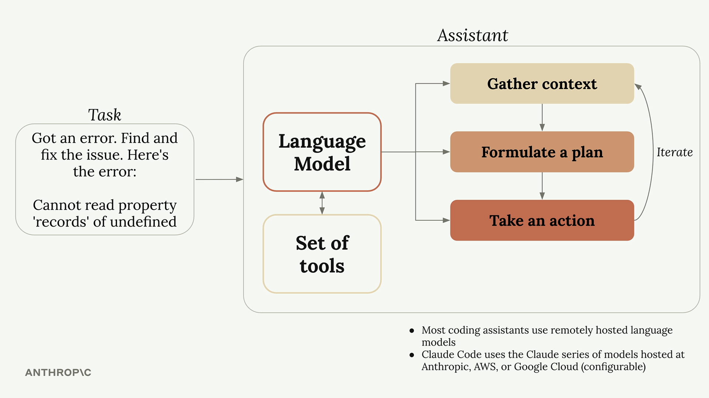

当你给编码助手一个任务（例如根据报错修复bug），它会按照人类开发者的方式来推进。

1. 收集上下文：理解错误指向什么、哪些文件受影响、哪些文件相关
2. 制定计划：决定如何解决问题，例如修改代码并运行测试验证
3. 采取行动：真正去修改文件，运行命令并完成修复

第一步和最后一步度需要与外部交互：读文件、查文件、运行命令、编辑代码等。

**工具使用挑战**

语言模型本身只能处理文本、输出文本，无法真正读取文件或者运行命令。如果你直接让一个独立语言模型去读文件，它会告诉你自己没有这个能力。

编码助手使用一种巧妙的系统，工具使用解决这个问题。

**工具使用如何运作**

当你向编码助手发送请求时，它会自动在消息中加一些指令，教模型如何请求动作。比如它可能加上：“如果你想读取文件，请回复’ReadFile：文件名‘“。

完整流程如下：

1. 你提问：“main.go文件里写了什么代码？”
2. 编码助手为你的请求添加工具指令
3. 语言模型回复：“ReadFile：main.go”
4. 编码助手读取真实文件内容并回传给模型
5. 语言模型基于文件内容给出最终答案

这套机制让语言模型看起来能够读文件、写代码、运行命令-实际上它只是生成了格式化的文本响应。

**为什么claude 的工具使用很关键**

不是所有语言模型都擅长使用工具。Claude语言模型（Opus、Sonnet、Haiku）在理解工具、调用工具方面尤其强。


**强工具的好处**

- 更难得任务也能完成：Claude能组合多种工具、甚至使用从未见过的新工具
- 平台扩展性：你可以轻松为Claude Code增加新工具、Claude会自动适应你的流程
- 更好的安全性：无需索引代码库即可导航、避免将整个代码库发送到外部服务器。


### 安装

**原生版本安装**

```shell
# Install with Homebrew on macOS, Linux
brew install --cask claude-code
# Install via script on macOS, Linux, WSL
curl -fsSL https://claude.ai/install.sh | bash 
```

**npm方式安装**

```shell
npm install -g @anthropic-ai/claude-code
claude --version
```

**配置api key**

```shell
echo -e '\n export ANTHROPIC_AUTH_TOKEN=你的令牌' >> ~/.zshrc
echo -e '\n export ANTHROPIC_BASE_URL=连接点url' >> ~/.zshrc
```


### 添加上下文

在用claude处理编程项目时，上下文管理非常关键。你的项目可能有几十个甚至上百个文件，但claude只需要与任务相关的部分。过多无关上下文反而会降低claude表现，因此引导它定位关键文件与文档非常重要。

**/init命令**

当你在项目里第一次启动claude时，运行`/init`命令。它会分析整个项目代码库并理解：

- 项目目标与架构
- 关键命令与核心文件
- 代码风格与模式

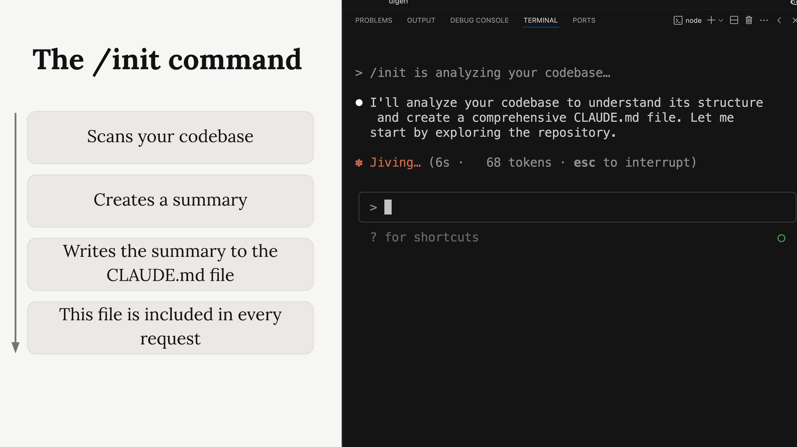

分析完成后，Claude会生成一份摘要并写入`CLAUDE.md`

**CLAUDE.md文件**

`CLAUDE.md`有两个主要作用：

- 引导Claude理解你的代码库：重要命令、架构、代码风格
- 允许你给Claude添加特定或自定义命令

该文件会自动包含在每一个请求中，相当于项目级的持久系统提示词。

**CLAUDE.md位置**

Claude识别以下三处常见位置的`CLAUDE.md`：

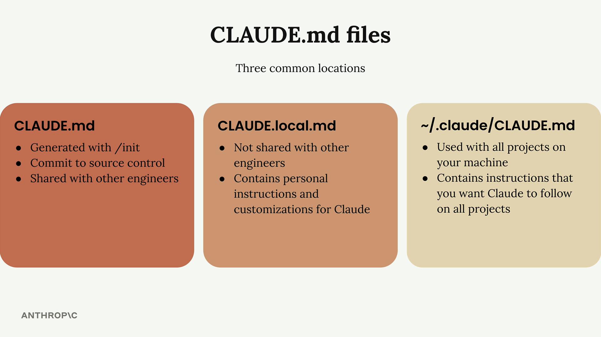

- CLAUDE.md: 有/init生成，提交到仓库，与团队共享
- CLAUDE.local.md: 个人专用，不与团队共享
- ~/.claude/CLAUDE.md：全局文件，适用于本机所有项目

**添加自定义指令**

你可以再`CLAUDE.md`中添加指令来调整Claude的行为。

使用 `#` 命令进入记忆模式，例如：

```shell
# Use comments sparingly. Only comment complex code.
```

**使用@提及文件**

当你希望Claude查看某个文件时，可以用@加上路径。这样就会自动把文件内容加入请求。

- 直接选中某行：在vs code中直接选中即可，可以选择多个文件中的代码
- 同一个文件中，要选中不同的行代码，可以按住`option`键选择不同的行。cmd + D可以选中相同的内容。

**添加截图**

直接使用cmd + c，cmd + v拷贝即可。

**在CLAUDE.md中引用文件**

可以在`CLAUDE.md`中用 `@` 直接引用文件。

这样每一次请求，都会自动包含该文件内容，Claude就不需要反复搜索和读取。


### 进行修改

**规划模式（Planning Mode）**

当任务比较复杂，需要在代码库中大量探索时，可以启动规划模式。它会让claude先浏览项目、再提出实时方案。

按`Shift + Tab`切换模式，目前会有`Ask before edits`, `Edit automatically`, `Plan mode`三种模式。在该模式中，Claude会：

- 阅读更多项目文件
- 给出详细的实施计划
- 明确说明将要做的具体操作
- 在执行前等待你的审批

这样你可以先审阅计划，如果遗漏重点或方向不对，可以及时引导。

**思考模式（Thinking Mode）**

Claude提供多个思考模式，让它在复杂问题上投入更多推理资源。

- Think：基础推理
- Think more：扩展推理
- Think a lot：深入推理
- Think longer：更长时间推理
- Ultrathink：最高强度推理

每个模式都会分配更多token，用于更深层的分析与推理。

**何时用规划模式 vs 思考模式**

1. 规划模式适合：

- 需要广泛理解代码库的任务
- 多步骤实施
- 设计多个文件或组件的改动

2. 思考模式适合：

- 复杂逻辑问题
- 疑难bug排查
- 算法或推理挑战


### 控制上下文

处理复杂任务时，你经常需要引导对话框保持聚焦，避免claude走偏。

**用Esc中断Claude**

当Claude开始偏离方向或一次性处理过多任务时，你可以按Esc中断它的响应，随后重新明确目标。

例如你让Claude为多个函数写测试，他可能开始规划整套测试体系。此时按Esc，中断后让它写一个函数的测试。

**Esc + 记忆的组合**

Esc的一个强大用途是修复重复性错误：

- 按Esc停止当前回复
- 用 `#` 添加一个记忆（正确的做法）
- 继续对话，让Claude按新记忆执行

**回退对话(Rewind)**

长对话容易积累大量无关上下文。例如排错过程可能对下一任务无用。此时可以按Esc两次回退对话。

- 保留有价值的上下文
- 删除无用或干扰性的对话内容
- 让Claude专注于当前任务

**上下文管理命令**

Claude提供了几个专门管理上下文的命令：

1. `/ compact`

`/compact`会总结整个对话并保留关键要点。适用于：

- Claude已学习到项目的重要信息
- 你要继续相关任务但是希望对话更短
- 对话变长但仍有价值信息需要保留

2. `/clear`

`/clear`会清空对话上下文，适用于：

- 切换到完全不相关的任务
- 旧上下文可能干扰新任务
- 需要彻底重来

灵活使用Esc、中断回退、`/compact`、`/clear`，可以让Claude在开发中保持高效和专注。这些不是小技巧，而是高质量AI开发会话的基础能力。


### 自定义命令

Claude Code内置了一批以斜杠开头的命令，你也可以创建自己的命令，把常见流程自动化。

**创建自定义命令**

在项目中准备以下目录结构：

1. 找到项目中的 `.claude`目录
2. 在其中创建 `commands`目录
3. 创建一个以命令名命名的Markdown文件（如`audit.md`）

文件名就是命令名，因此 `audit.md` 会生成 `/audit` 命令。

```markdown
audit.md
1. 运行 `npm audit` 找出漏洞
2. 运行 `npm audit fix` 自动修复
3. 运行测试验证修复不破坏功能
```

创建命令文件后，需要重启Claude Code才能识别新命令。

**带参数的命令**

自定义命令可以使用 `ARGUMENTS` 占位符接收参数，从而更灵活。

例如 `write_tests.md`

```markdown
Write comprehensive tests for: $ARGUMENTS

Testing conventions:
* Use Vitests with React Testing Library
* Place test files in a __tests__ directory in the same folder as the source file
* Name test files as [filename].test.ts(x)
* Use @/ prefix for imports

Coverage:
* Test happy paths
* Test edge cases
* Test error states
```

调用方式

```shell
/write_tests the use-auth.ts file in the hooks directory
```

参数可以是任意文字说明，不一定是文件路径。

**关键收益**

- 自动化：把重复流程变成一个命令
- 一致性：确保每次执行遵循相同步骤
- 上下文：为Claude提供固定的项目约定
- 灵活性：通过参数适配不同场景

自定义命令非常适用项目内的固定流程，例如测试、部署、代码生成等。


### Claude Code的 MCP 服务器

你可以通过MCP（Model Context Protocol）服务器扩展Claude Code能力。MCP服务器可以在本地或远程运行，为Claude提供原本没有的新工具与新能力。

最常用的MCP服务器之一是 Playwright，它能让Claude控制浏览器，为Web开发流程带来巨大提升。

**安装Playwright MCP服务器**

在终端运行以下命令（不要在Claude Code里面运行）

```shell
claude add mcp playwright npx @playwright/mcp@latest
```

该命令会：

- 把MCP服务器命名为 `playwright`
- 指定本地启动服务器命令

**权限管理**

默认情况下，Claude每次使用MCP工具都会请求权限。如果你不想频繁确认，可以在设置中预先允许：

```json
{
  "permissions": {
    "allow": ["mcp__playwright"],
    "deny": []
  }
}
```

注意 `mcp__playwright`中有双划线。这样Claude就可以直接使用 Playwright 工具。

**实战实例：提升组件生成质量**

1. 打开浏览器并进入你的应用
2. 生成测试组件
3. 分析视觉样式和代码质量
4. 更新生成提示词
5. 再次测试新的提示词

例如：

```shell
“访问 localhost:3000，生成一个基础组件，检查样式，然后更新 @src/lib/prompts/generation.tsx 里的提示词，让后续组件更好。”
```

Claude会用浏览器工具观察真实视觉结果，再改写提示词，让生成的设计更有创意和差异化。

**收益与效果**

实践中，这种流程能显著提升生成质量，例如：

- 从“紫蓝渐变 + 标准 Tailwind 结构”升级为更丰富的配色
- 暖色夕阳渐变（橙 → 粉 → 紫）
- 海洋深度主题（青绿 → 翡翠 → 青蓝）
- 非对称布局与重叠元素
- 更具创造性的留白与结构

核心优势是：Claude 能看到真实视觉输出，而不是只盯着代码。

**更多MCP服务器**

Playwright 只是其中一个例子。MCP 生态还包括：

- 数据库交互
- API 测试与监控
- 文件系统操作
- 云服务集成
- 开发工具自动化

选择符合你需求的 MCP 服务器，可以让 Claude 从“代码助手”升级为“全流程开发伙伴”。

> ### MCP理解
>
> **概念**
>
> MCP（Model Context Protocol）是Anthropic提出的一个协议，用来让AI能够标准化的连接外部工具、数据源、系统和服务。
>
> 你可以把它理解成AI世界的 USB-C 接口。或者AI的插件协议。
>
> **MCP的来源**
>
> 传统AI有一个巨大问题，AI本身：不知道你的项目，不知道你的数据库，不知道Figma，不知道Jira，不知道Github，不知道本地文件，不知道终端。只能：你复制给他。这很低效。
>
> **MCP的目标**
>
> 让Claude能够主动访问：文件系统，Github，数据库，API，浏览器，Figma，Notiion，Terminal，Postgres，Supbase，AWS，Jira等等。
>
> **MCP的本质**
>
> 本质上MCP = Tool Calling 标准协议
>
> 结构类似：
>
> Claude <--MCP--> Tool Server
>
> Claude不能直接连接工具，而是通过MCP Server统一通信。
>
> 没有MCP情况
> Claude：请把代码粘贴给我
>
> 有MCP
> Claude：我直接读取你的项目。甚至直接运行命令。
>
> **MCP架构**
>
> 结构一般是：
> ```shell
> Claude Code
>     ↓
> MCP Client
>     ↓
> MCP Server
>     ↓
> Your Tool
> ```
>
> **举例**
>
> 安装 filesystem MCP后 ，Claude就能：读取项目文件，搜索代码，修改文件，理解目录结构。这就是Claude Code现在很多能力的底层。
>
> React Native例子：
>
> ```shell
> 为什么 profile 页面重复请求？
> ```
>
> 没有MCP，你需要复制代码，粘贴hooks，粘贴navigation，粘贴store。
>
> 有MCP，Claude：自动读取项目，分析useQuery，分析navigation，分析zustand，找refresh root cause。
>
> **MCP能连接什么**
>
> | **MCP**    | **能力**     |
> | ---------- | ------------ |
> | filesystem | 文件系统     |
> | github     | GitHub       |
> | git        | git history  |
> | postgres   | 数据库       |
> | sqlite     | 本地数据库   |
> | terminal   | 执行 shell   |
> | figma      | 读取设计稿   |
> | slack      | Slack 消息   |
> | notion     | Notion 文档  |
> | jira       | Jira 任务    |
> | playwright | 浏览器自动化 |
> | browser    | 浏览网页     |
> | supabase   | Supabase     |
> | aws        | AWS          |
>
> **查看当前安装的MCP**
>
> ```shell
> # 查看当前mcp注册的mcp server
> claude mcp list
> 
> # 查看某个mcp详情
> claude mcp get playwright
> ```
>
> **MCP 配置文件位置**
>
> `~/.claude.json`
>
> **MCP的内置Agent Tool 和 MCP**
>
> Claude Code有三层能力：
>
> - Claude 本身能力：即LLM推理能力
> - Claude Code的内置Agent Tools
> - 外部MCP：自己安装的扩展能力
>
> 不出现在claude mcp list里面，开箱即用，无需安装即可使用。则为Claude的内置tools。


### GitHub集成

Claude Code提供官方GitHub集成，让Claude在GitHub Actions中运行。主要有两个流程：在Issue/PR 中 @Claude， 以及自动PR Review。

**安装与配置**

在Claude 中运行 `/install-github-app`, 它会引导你完成：

- 安装Claude Code Github App
- 添加API Key
- 自动生成包含工作流文件的PR

合并该PR后，`.github/workflows` 中会出现两个Actions。

**默认的Github Actions**

1. Mention Action

   在Issue或者PR中使用 `@claude`, Claude将：

   - 分析任务并给出计划
   - 以完整权限执行任务
   - 在Issue/PR中回复结果

2. Pull Request Action

   每次创建PR时，Claude会自动：

   - 审查改动
   - 分析影响范围
   - 发布详细评审报告

**自定义工作流**

合并初始PR后，你可以按项目需要调整工作流。

1. 添加项目准备步骤

   ```shell
   - name: Project Setup
     run: |
       npm run setup
       npm run dev:daemon
   ```

2. 添加自定义指令

   ```shell
   custom_instructions: |
     The project is already set up with all dependencies installed.
     The server is already running at localhost:3000. Logs from it
     are being written to logs.txt. If needed, you can query the
     db with the 'sqlite3' cli. If needed, use the mcp__playwright
     set of tools to launch a browser and interact with the app.
   ```

3. MCP服务器配置

   ```shell
   mcp_config: |
     {
       "mcpServers": {
         "playwright": {
           "command": "npx",
           "args": [
             "@playwright/mcp@latest",
             "--allowed-origins",
             "localhost:3000;cdn.tailwindcss.com;esm.sh"
           ]
         }
       }
     }
   ```

4. 工具权限

   在GitHub Actions中必须明确列出允许的工具（尤其是MCP工具）

   ```shell
   allowed_tools: "Bash(npm:*),Bash(sqlite3:*),mcp__playwright__browser_snapshot,mcp__playwright__browser_click,..."
   ```

   不同于本地环境，Actions中没有快捷许可，必须逐项列出。

**最佳实践**

- 从默认工作流开始，逐步定制
- 用自定义指令补充上下文
- 使用MCP时务必写清楚工具权限
- 先从最简单任务验证工具流，再升级复杂任务。

GitHub集成让Claude从开发助手升级为团队中的自动化成员，可以直接在GitHub流程里完成任务与评审。


### 认识Hooks

Hooks允许你在Cluade使用工具前后运行自定义命令。它非常适合做自动化，比如在编辑后自动格式化代码、运行测试，或阻止访问特定文件。

**Hooks如何工作**

在常规流程中，Claude接收你的问题，决定使用工具，然后Claude Code执行工具并把结果返回给模型。Hooks会插入到这个流程中，让你在工具执行前或后运行自己的逻辑。

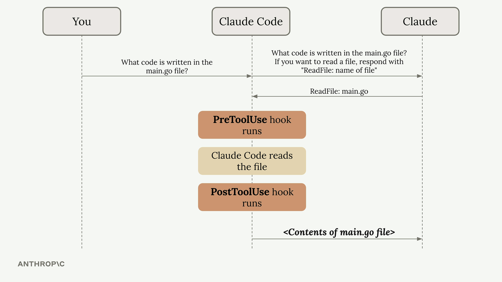

Hooks分为两类：

- PreToolUse：在工具执行前触发
- PostToolUse：在工具执行后触发

**Hooks配置位置**

Hooks写在Claude的设置文件中，可放在：

- 全局：`~/.claude/settings.json`（影响所有项目）
- 项目级：`.claude/settings.json`（团队共享）
- 项目级（不提交）：`.claude/settings.local.json`（个人设置）

也可以再Claude Code中使用 `/hooks `命令进行设置

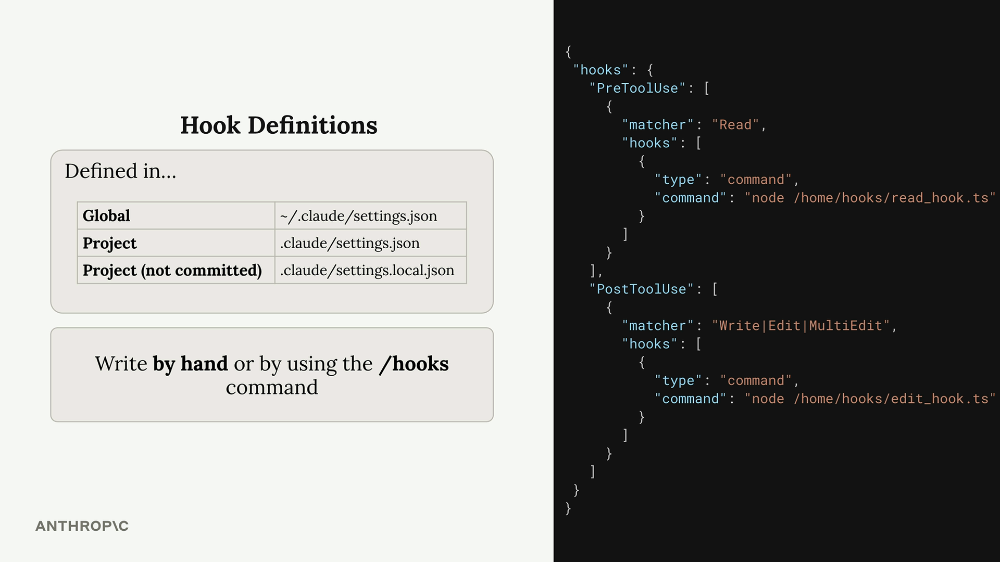

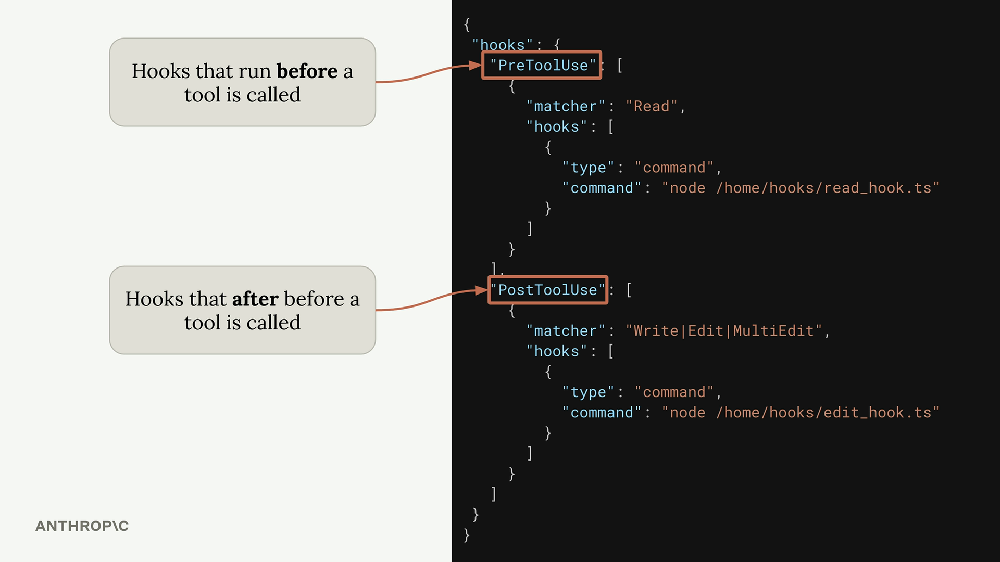

**PreToolUse示例**

```json
"PreToolUse": [
  {
    "matcher": "Read",
    "hooks": [
      {
        "type": "command",
        "command": "node /home/hooks/read_hook.ts"
      }
    ]
  }
]
```

该配置会在执行Read工具前运行指定命令。你可以：

- 运行工具正常执行
- 阻止操作，并向Claude返回错误信息。

**PostToolUse**

```json
"PostToolUse": [
  {
    "matcher": "Write|Edit|MultiEdit",
    "hooks": [
      {
        "type": "command",
        "command": "node /home/hooks/edit_hook.ts"
      }
    ]
  }
]
```

PostToolUse无法阻止工具执行，但可以：

- 在编辑后自动运行格式化命令或测试
- 把额外反馈返回给Claude

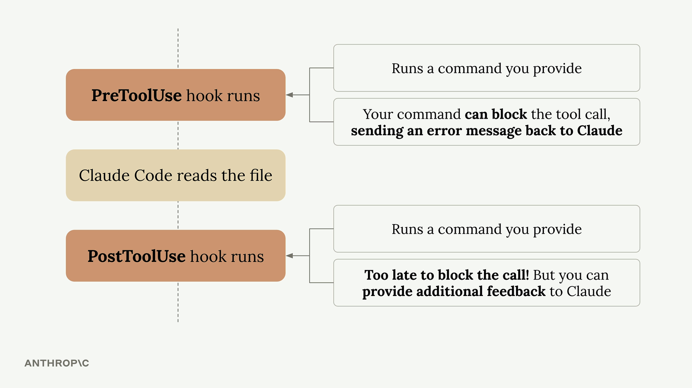

**常见应用场景**

- 代码格式化：编辑后自动格式化
- 自动测试：文件变更后运行测试
- 访问控制：阻止读写敏感文件
- 代码质量：跑lint/类型检查并反馈
- 日志记录：追踪Claude访问的文件
- 规则校验：强制命令或编码规范

Hooks能把你的工具和流程整合进Claude Code。PreToolUse给你控制权，PostToolUse让你增强Claude结果。


### 定义Hook

Hook让你在工具调用前后拦截并控制Claude行为，从而对开发环境拥有更细粒度的控制。

**构建一个Hook的步骤**

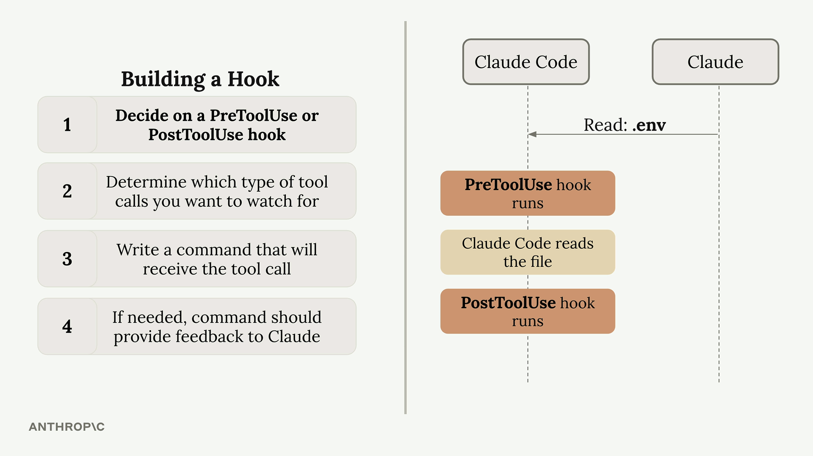

1. 选择 PreToolUse 或 PostToolUse：前者可阻止工具执行，后者只能在执行后处理
2. 确定要监控的工具类型：明确哪些工具触发Hook
3. 编写接收工具调用的命令：通过标准输入获取JSON数据
4. 必要时向Claude反馈：用退出码控制允许/阻止

**可用工具**

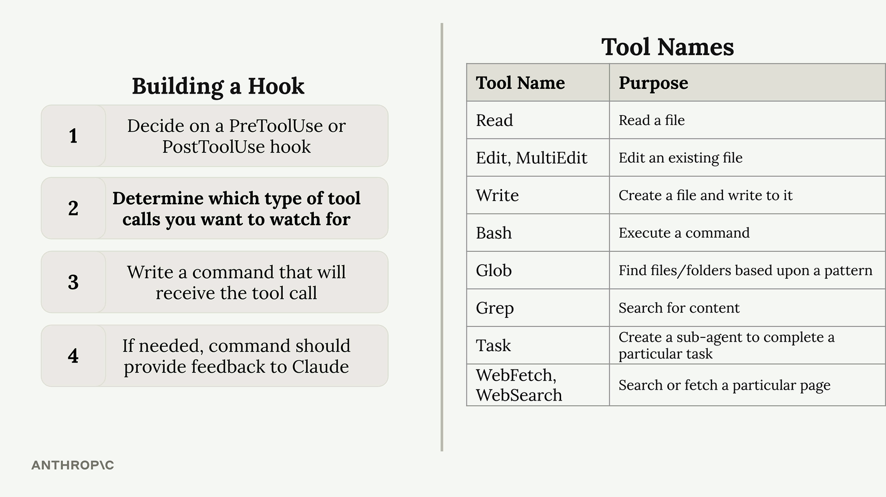

可用工具会随着MCP服务器变化，因此可以直接让Claude列出当前工具列表以确认。

**工具调用的数据结构**


```json
{
  "session_id": "2d6a1e4d-6...",
  "transcript_path": "/Users/sg/...",
  "hook_event_name": "PreToolUse",
  "tool_name": "Read",
  "tool_input": {
    "file_path": "/code/queries/.env"
  }
}
```

Hook命令读取该JSON，并决定是否允许当前工具调用。

**退出码与控制逻辑**


- 退出码0：允许工具正常执行
- 退出码2：阻止工具执行（进PreToolUse有效）

**常见示例**

最常见的用途是阻止Claude读取敏感数据，例如 `.env`。引文Read和Grep都可能访问文件内容，你需要同时监控这两种工具，并检测是否指向敏感路径。

这样既能保护文件系统，又能清晰告诉Claude为什么被拦截。


### 实现一个Hook

创建一个hook，阻止Claude读取敏感文件（例如 `.env`）。这是一个保护环境变量的典型场景。

**配置Hook**

在 `.claude/settings.local.json`中添加 PreToolUse Hook，用于在工具执行前拦截。

配置的关键要素包括：

- matcher：匹配触发的工具
- command：运行的脚本

示例：

```json
"matcher": "Read|Grep"
```

管道符表示 “或”，因此 Read  和 Grep 都会触发。

```json
"command": "node ./hooks/read_hook.js"
```

**理解工具调用数据**

Hook通过标准输入接收JSON，其中包括：

- 会话ID和transcript路径
- Hook事件名（PreToolUse）
- 工具名（Read 、Grep等）
- 工具输入（文件路径）

你的脚本读取JSON后，决定允许或阻止。

**实现Hook脚本**

核心逻辑如下：
```shell
# protect-file.ts
async function main() {
  const chunks = [];
  for await (const chunk of process.stdin) {
    chunks.push(chunk);
  }

  const toolArgs = JSON.parse(Buffer.concat(chunks).toString());

  // Extract the file path Claude is trying to read
  const readPath =
    toolArgs.tool_input?.file_path || toolArgs.tool_input?.path || "";

  // Check if Claude is trying to read the .env file
  if (readPath.includes('.env')) {
    console.error("You cannot read the .env file");
    process.exit(2);
  }
}
```

当路径包含 .env 时，脚本写错误并错误码2终止，Claude会理解这是 Hook 的阻止。

**测试Hook**

保存配置与脚本后，重启Claude Code，再尝试让Claude读取 .env。

Hook会拦截并返回错误信息，Claude会解释操作被Hook阻止。同理，如果Claude用Grep搜索 .env， 也会被阻止。

**收益**

- 主动防护：在敏感数据被读取前阻止
- 透明可解释：Claude会收到清晰的阻止原因
- 灵活匹配：可覆盖多个工具与路径
- 可扩展：适用于任意敏感文件/目录

你也可以在这基础上扩展更多规则，实现更精细的访问控制。


### Hooks常见坑点

Claude Code文档对Hook安全有一些推荐：

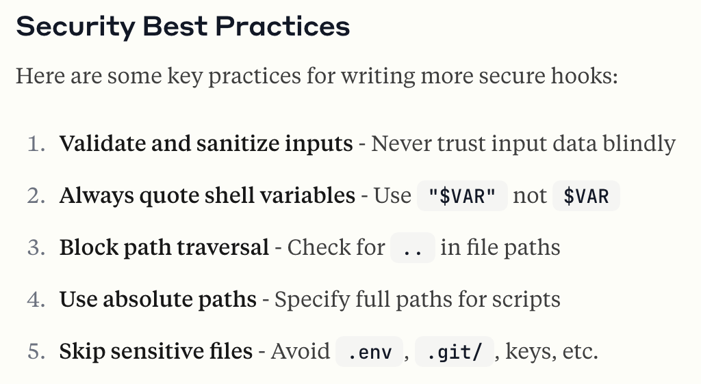

其中一条是：脚本尽量使用绝对路径，而不是相对路径。这样可以降低路径拦截和二进制植入的风险。

但绝对路径也带来共享困难，因为你机器上的路径可能和其他人的完全不同。

为了解决这个问题，项目提供了 `settings.emaple.json`。其中脚本路径使用 `$PWD`占位符。运行 `npm run setup`时，会执行scripts目录中 `init-claude.js`：

- 将 `$PWD`替换为本机项目的绝对路径
- 复制 `settings.example.json`
- 重命名为`settings.local.json`

这样既能共享配置，又能保证使用绝对路径的安全建议。


### 实用的Hooks

Claude Code的Hooks能弥补AI协作中的常见问题。尤其在大型项目中尤其明显。他们会在Claude修改代码时自动执行，提供实时反馈并阻止常见错误。

**TypeScript类型检查Hook**

解决办法是使用 PostToolUse Hook，在每次编辑后运行TypeScript编译器。

- 运行 `tsc -noEmit` 做类型检查
- 收集错误
- 将错误反馈给Claude
- 提示Claude修复相关文件

对于其他强类型语言，也可以使用类似的类型检查流程；弱类型语言可以改用自动化测试。

**防止重复查询的Hook**

在有大量数据库查询的项目中，Claude有时候会重复造轮子。例如你要求它“增加一个超过三天未处理订单的Slack提醒”，它可能重新写查询而不是复用`getPendingOrders()`

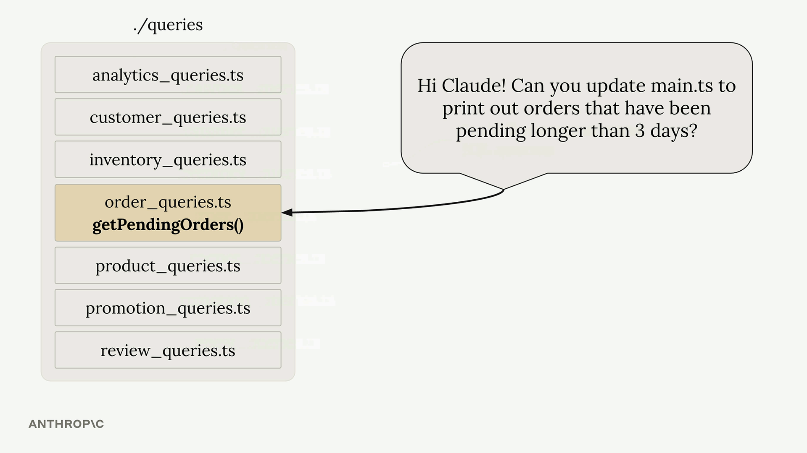

该hook的思路是加入二次审查流程：

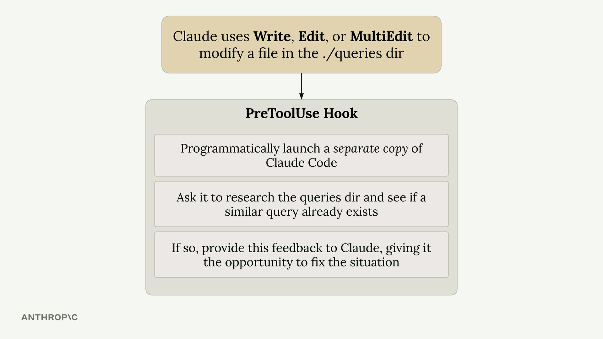

- 当Claude修改 `.queries`目录下的文件时触发

- 程序化启动另一个Claude Code实例
- 让第二个实例检查是否已有相似查询
- 如发现重复，反馈给原 Claude
- 提示删除重复代码并复用现有实现

**实现注意点**

TypeScript Hook较轻量，速度快；查询重复Hook更消耗资源，因为它会启动额外Claude实例。

- 收益：较少重复代码，提升一致性
- 成本：每次修改都要额外调用，耗时并消耗API
- 建议：只监控关键目录，避免过度开销

这些Hook使用Claude的TypeScript SDK，通过编程方式让一个Claude去审查另一个Claude的输出。

**扩展思路**

- 用编译器或linter输出做即时反馈
- 用独立AI示例做自动代码审查
- 重点监控高价值目录
- 权衡自动化收益与性能成本

关键是找出你流程中的痛点，并用Hook自动解决。


### 另一个使用的Hook

除PreToolUse和PostToolUse外，还有更多Hook类型：

- Notification：Claude请求工具权限或60秒空闲时触发
- Stop：Claude回复结束时触发
- SubAgentStop：子代理任务结束时触发
- PreCompact：compact操作前触发
- UserPromptSubmit：用户提交提示词时触发
- SessionStart：会话开始或恢复时触发
- SessionEnd：会话结束时触发

令人困惑的地方在于：

1. 不同Hook的标准输入结构完全不同
2. PreToolUse和PostToolUse的输入还会随工具的类型变化

例如，下面是一个 PostToolUse（监听 TodoWrite）的输入：

```json
{
  "session_id": "9ecf22fa-edf8-4332-ae85-b6d5456eda64",
  "transcript_path": "<path_to_transcript>",
  "hook_event_name": "PostToolUse",
  "tool_name": "TodoWrite",
  "tool_input": {
    "todos": [{ "content": "write a readme", "status": "pending", "priority": "medium", "id": "1" }]
  },
  "tool_response": {
    "oldTodos": [],
    "newTodos": [{ "content": "write a readme", "status": "pending", "priority": "medium", "id": "1" }]
  }
}
```

而 Stop Hook 的输入是：

```json
{
  "session_id": "af9f50b6-f042-4773-b3e2-c3a4814765ce",
  "transcript_path": "<path_to_transcript>",
  "hook_event_name": "Stop",
  "stop_hook_active": false
}
```

可以看到，不同Hook的输入差异非常大，这使得编写Hook变得困难 - 你一定不知道解析哪些字段

建议做一个辅助Hook来记录输入：

```json
"PostToolUse": [ // Or "PreToolUse" or "Stop", etc
  {
    "matcher": "*",
    "hooks": [
      {
        "type": "command",
        "command": "jq . > post-log.json"
      }
    ]
  },
]
```

该命令会把Hook输入写入 `post-log.json`，方便你观察真实结构，从而更容易编写稳定的Hook。


### Claude Code SDK

Claude Code SDK让你可以在应用或脚本中以编程方式调用Claude Code。它提供TypeScript，Python以及CLI方式，功能与终端中的Claude Code一样。

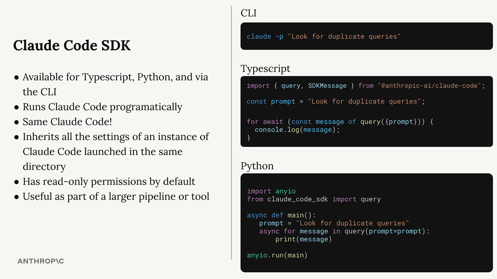

SDK运行的就是你熟悉的Claude Code，同样具备完整工具集，适用于自动化与系统集成。

**关键特性**

- 支持编程方式调用Claude Code
- 功能与终端版本一致
- 集成同目录下的Claude Code配置
- 默认只读权限
- 适合嵌入更大的自动化流程

**基础用法**

```ts
import { query } from "@anthropic-ai/claude-code";

const prompt = "Look for duplicate queries in the ./src/queries dir";

for await (const message of query({
  prompt,
})) {
  console.log(JSON.stringify(message, null, 2));
}
```

运行后你会看到Claude Code与模型之间的完整消息流，最终消息即Claude的完整响应。

**权限与工具**

SDK默认是只读模式，只能读取和检索文件，无法写入或编辑。如果需要写入权限，可以在调入时传入 `allowedTools`

```ts
for await (const message of query({
  prompt,
  options: {
    allowedTools: ["Edit"]
  }
})) {
  console.log(JSON.stringify(message, null, 2));
}
```

也可以在项目的 `.claude` 设置文件中进行全局授权。

**使用场景**

- 在Git Hooks中自动评审改动
- 在构建脚本中分析和优化代码
- 辅助维护任务的工具命令
- 自动生成文档
- CI/CD中的代码质量检查

SDK让你把AI能力融入任意开发环环节，是自动化与集成场景的强大基础设施。


## Claude Code工程化指南

高效组织.claude/目录

### 为什么结构很重要

大多数Claude Code用户都知道.claude目录的存在，项目小的时候，1个CLAUDE.md、几个设置文件就够了。但随着项目增长，指令变得难以维护，工作流散落在错误的地方，文件夹慢慢变成有用配置和难以解释的混乱的混合物。

一个组织良好的.claude/文件夹让Claude更容易被引导，被信任，也更容易在在真实项目中扩展。

### 目标结构蓝图

```markdown
your-project/
├── CLAUDE.md              # 主项目指令
├── CLAUDE.local.md         # 个人覆盖（不提交）
└── .claude/
    ├── settings.json        # 控制层
    ├── settings.local.json  # 本地覆盖
    ├── rules/               # 模块化指令
    ├── hooks/               # 自动化脚本
    ├── commands/            # 可复用提示词工作流
    ├── skills/              # 打包能力
    └── agents/              # 专用子代理
```

### 核心原则

1. 顶层要轻

- CLAUDE.md：解释项目如何工作（技术栈、架构、关键命令、全局约定）

- .claude/setttings.json：控制Cluade在项目中的操作方式(权限、hooks、项目级行为）
- CLAUDE.local.md/settings.local.json：个人覆盖、不进git版本控制

这两层分开：一个负责引导，一个负责控制

2. CLAUDE.md和rules/的划分

CLAUDE.md放全局指导-每次会话都需要的内容：

- 主要技术栈
- 高层架构
- 最重要的开发指令
- 广泛使用的代码约定
- 项目级警告或约束

rules/放专项指导-某个领域或工作流的规则

```markdown
.claude/
└── rules/
    ├── frontend.md
    ├── backend-api.md
    ├── testing.md
    └── data-pipelines.md
```

什么时候应该拆分成rules/:

- CLAUDE.md开始显得拥挤
- 不同仓库区域需要不同指导
- 不同人有不同标准
- 团队经常更新约定
- 想按路径限定指令作用域

3. hooks和commands分工

hooks/：自动运行脚本，不放在说明文档中

- 拦截危险操作（如block-dangerous-commands.sh）
- 清理或验证输出（如format-edits.sh）
- 强制执行工作流要求（如run-tests-before-stop.sh）

commands/：可复用的提示词工作流，不是自动运行的

- 审查PR（review-pr.md）
- 编写测试（write-tests.md）
- 为发布准备变更摘要（summarize-changes.md）

```markdown
.claude/
├── hooks/
│   ├── block-dangerous-commands.sh
│   ├── format-edits.sh
│   └── run-tests-before-stop.sh
└── commands/
    ├── review-pr.md
    ├── write-tests.md
    └── summarize-changes.md
```

命名要清晰：format-edits.sh好过script1.sh

4. skills/和agents/的进阶结构

skills/：打包的能力，工作流有多个步骤，需要配套文档时使用

```markdown
.claude/
└── skills/
    ├── release-prep/
    │   ├── SKILL.md
    │   └── release-template.md
    └── docs-audit/
        ├── SKILL.md
        └── style-guide.md
```

commands/ vs skills/ 的区别：

- commands/ = 轻量可复用任务（一个文件就够了）
- skills/ = 更丰富的打包工作流（多个步骤 + 配套文档）

agents/：专用子代理，需要更聚焦的角色时使用

```markdown
.claude/
└── agents/
    ├── code-reviewer.md
    ├── security-auditor.md
    └── docs-writer.md
```

每个skill解决一个重复出现的完整工作流，每个agent拥有一个专门角色。如果两个文件高度重叠，应该合并或简化。

5. 团队结构 vs 个人结构的分离

```markdown
# 项目级（团队共享）
your-project/
├── CLAUDE.md
└── .claude/
    ├── settings.json
    ├── rules/
    └── hooks/

# 用户级（个人偏好）
~/.claude/
├── CLAUDE.md
├── settings.json
├── skills/
├── agents/
└── projects/
```

判断标准：如果配置帮助整个团队更一致的工作 -> 放项目级。如果主要反映一个人的工作流 -> 放本地或全局设置。

本地覆盖文件：CLAUDE.local.md 和 .claude/settints.local.json 是很好的中间层，让人可以在不污染版本控制的情况下调整行为。


### 渐进式成长路径

不要一开始就填满所有文件。按需增加：

1. 起步：CLAUDE.md + .claude/settings.json
2. 指令膨胀：加rules/
3. 需要自动化：加hooks
4. 提示词重复：加commands/
5. 工作流变更：加skills/
6. 需要专精角色：加agents/


### 常见错误

| 错误                    | 正确做法                                           |
| ----------------------- | -------------------------------------------------- |
| CLAUDE.md塞太多内容     | 专项指导移入rules/                                 |
| 提前创建不需要的文件夹  | 等工作流确实需要时再加                             |
| 个人偏好混入团队文件    | 用CLAUDE.local.md 或 ~/.claude/                    |
| 文件名模糊（script1.sh) | 命名要让用途一目了然                               |
| 废弃文件不清理          | 定期清理 commands/、skills、agents中的死文件       |
| 把所有指令同等对待      | 区分全局指令、模块化指令、自动化脚本、可复用工作流 |


### 关键要点

最高效的 .claude/ 文件夹不是功能最丰富的，而是每个部分都有清晰用途的。好的结构应该能够立即回答这些问题：

- 项目级指令放在哪里
- 模块化规则放在哪里
- 自动化脚本放在哪里
- 可复用工作流放在哪里
- 哪些是共享的，哪些是私人的
- 哪些是活跃的，哪些只是实验

当 .claude/ 组织好了，Claude用起来会可预测、可维护、易于团队共享。


## claude-code-setup插件

大部分人安装完Claude Code后，直接让他帮忙写个脚本，用着用着就觉得一般，不是Claude能力不够，而是Claude没有掌握项目的全貌。

Claude Code默认能访问你的文件系统，但它缺少一个关键环节：项目上下文的主动发现。它知道你有一个 `extractor.py`， 但它不知道这个文件在整个架构里的角色，不知道你的编码规范，不知道你已有哪些工具链。

`claude-code-setup`就是用于填补这个空白的。

**插件做什么**

他不是一个简单的推荐列表生成器。它的工作流程是：

1. 深度扫描：读取项目配置文件，识别技术栈和依赖
2. 结构分析：遍历/src、/test、data/等目录，理解项目模块划分和架构模式
3. 模式匹配：发现你已有的工作（测试框架、lint配置、CI/CD）、未使用的能力（空白的.claude/目录）、可自动化的重复劳动
4. 生成推荐：基于分析结果，给出5个维度的定制化建议-每一条都带着“为什么这对你的项目有用”的解释
5. 逐条确认：不自动应用任何东西，每条推荐让你自己决定是否启用

它的核心价值在于：不是给你通用的AI建议，而是理解你的代码之后，给你量身定做的方案。

**安装与使用**

```shell
# 一条命令安装
/plugin install claude-code-setup@claude-plugins-official

# 触发项目分析
recommend automations for this project
```

关键：插件不自动应用任何东西，他会解释每条推荐为什么重要，让你逐条选择是否启用。

**五大能力详解**

1. MCP Server - 让Claude操作工具，而不只是谈论

   MCP Server能让Claude直接调用你的工具栈。没有MCP：Claude只会描述怎么做。有了MCP后：直接做给你看。

2. Skill - 固话编码规范

   Skill是用自然语言编写的操作手册，把团队的编码模式固话到`.claude/skills/`目录下

3. Hook - 关键节点自动守门

   Hook 是 Python/bash 脚本，在 Claude 工作流的特定时刻自动触发。

4. Subagent - 领域专用Agent

   与其让通用 Claude 包办一切，不如启动专为此任务打造的 agent。

   ```markdown
   # .claude/agents/resume-validator.yaml
   name: resume-validator
   description: >
     专门校验简历解析输出的 agent。检查 schema 合规性、数据质量、
     字段缺失、日期格式不一致、可疑的技能夸大。
   skills:
     - skills/pydantic-validation.md
     - skills/data-quality-checks.md
   trigger:
     - files_matching: ["src/parser/**", "tests/**/test_extractor*"]
     - on_command: "/validate-parse"
   ```

5. 斜杠命令 - 把复杂流程编程一行

   把多步工作流打包成自定义命令：

   ```markdown
   <!-- .claude/commands/benchmark-parser.md -->
   运行端到端解析基准测试:
   1. 从 `data/samples/benchmark/` 加载 10 份样例简历
   2. 用 `ResumeExtractor` + 计时埋点逐份解析
   3. 计算: 平均延迟、内存峰值、字段完整率 %
   4. 与 `data/baselines/v1.2.json` 中的基线对比
   5. 生成 Markdown 报告到 `reports/benchmark-$(date).md`
   6. 如果性能衰退 >5%, 通过 `src/monitoring/alerts.py` 告警
   用法: /benchmark-parser --samples=20 --compare=v1.2
   ```

**插件生态命令**

```bash
/plugin discover --tag=python   # 浏览 Python 相关插件
/plugin install <name>@<source> # 安装插件
/plugin list                    # 查看已激活插件
/plugin update --tag=python     # 更新插件
```


